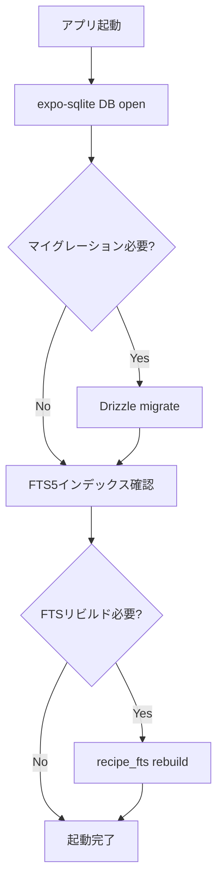

# だいどこ — アーキテクチャ設計書

> 改訂: 2026-05-04  
> ステータス: Draft

---

## 1. 技術スタック選定

### 1.1 プラットフォーム：React Native + Expo（推奨）

| 観点                   | React Native / Expo    | Flutter           | iOS ネイティブ (Swift) |
| ---------------------- | ---------------------- | ----------------- | ---------------------- |
| iOS / Android 同時対応 | ✅                     | ✅                | ❌（iOS のみ）         |
| 開発言語               | TypeScript             | Dart              | Swift                  |
| SQLite 対応            | expo-sqlite（公式）    | sqflite           | FMDB / GRDB            |
| OCR 対応               | ML Kit / Vision Camera | ML Kit            | Vision Framework       |
| 画像ラベル推測         | ML Kit / Vision        | ML Kit            | Vision Framework       |
| カメラ対応             | expo-camera            | camera プラグイン | AVFoundation           |
| Web エクスポート       | expo-web で可能        | Flutter Web       | ❌                     |
| エコシステム規模       | 最大                   | 大                | 中                     |
| 採用人材の確保         | 容易（JS/TS 人材）     | やや難            | 難                     |

**採用理由**: ローカルファーストの SQLite・カメラ OCR・同期 API クライアント、いずれも Expo の公式エコシステムで揃う。TypeScript 一本でフロント〜BFF が書けるため、小規模チームでの開発速度が最大化される。将来的な Web 対応も Expo Router で可能。

### 1.2 フロントエンド主要ライブラリ

| 役割             | 採用ライブラリ                     | 選定理由                           |
| ---------------- | ---------------------------------- | ---------------------------------- |
| フレームワーク   | Expo SDK 51+                       | Managed workflow で環境構築ゼロ    |
| ナビゲーション   | Expo Router v3                     | ファイルベースルーティング・型安全 |
| ローカル DB      | expo-sqlite + Drizzle ORM          | SQLite FTS5 対応・型安全なクエリ   |
| サーバー状態管理 | TanStack Query v5                  | キャッシュ・同期・楽観的更新       |
| クライアント状態 | Zustand                            | 軽量・シンプル・TypeScript 親和性  |
| フォーム         | React Hook Form + Zod              | バリデーション・型生成の一元化     |
| カメラ / OCR     | react-native-vision-camera + MLKit | iOS/Android 両対応の OCR           |
| 料理写真推測     | ML Kit Image Labeling / Vision     | 端末内で低遅延に画像ラベルを抽出   |
| 画像処理         | expo-image-manipulator             | リサイズ・圧縮                     |
| アニメーション   | Reanimated 3                       | ネイティブスレッドアニメーション   |
| アイコン         | Lucide React Native                | SVG ベース・軽量                   |

### 1.3 バックエンド

| 役割               | 採用技術                           | 選定理由                                      |
| ------------------ | ---------------------------------- | --------------------------------------------- |
| ランタイム         | Node.js 20 LTS                     | 安定性・エコシステム                          |
| フレームワーク     | Hono                               | 超軽量・Cloudflare Workers/VPS 両対応・型安全 |
| 言語               | TypeScript                         | フロントと共通型定義が可能                    |
| データベース       | PostgreSQL 16                      | JSON カラム・全文検索・信頼性                 |
| ORM                | Drizzle ORM                        | フロントの Drizzle と schema 共有可能         |
| 認証               | JWT（jose） + リフレッシュトークン | シンプル・ステートレス                        |
| ファイルストレージ | S3 互換（MinIO or Cloudflare R2）  | 写真・OCR 画像の保存                          |
| インフラ           | VPS（Ubuntu） + Docker Compose     | コスト低・フルコントロール                    |

### 1.4 共通型定義（モノレポ）

フロント・バックエンドを同一リポジトリに配置し、`packages/shared` で型と Zod スキーマを共有する。

```
daidoko/
├── apps/
│   ├── mobile/        # Expo アプリ
│   └── server/        # Hono API サーバー
└── packages/
    └── shared/        # 型定義・Zodスキーマ・定数
        ├── schema/    # Drizzle schema（フロント/バック共用）
        └── types/     # API リクエスト/レスポンス型
```

---

## 2. アプリケーションアーキテクチャ

### 2.1 全体構成図

```
┌─────────────────────────────────────────────────┐
│                  Mobile App (Expo)               │
│                                                  │
│  ┌──────────┐  ┌──────────┐  ┌───────────────┐  │
│  │  Screens  │  │  Stores  │  │  Background   │  │
│  │(Expo Router)│ │(Zustand) │  │  Sync Worker  │  │
│  └────┬─────┘  └────┬─────┘  └──────┬────────┘  │
│       │             │               │            │
│  ┌────▼─────────────▼───────────────▼─────────┐  │
│  │              Service Layer                  │  │
│  │  RecipeService / SyncService / OCRService  │  │
│  │  PhotoRecipeService                        │  │
│  └────────────────────┬───────────────────────┘  │
│                       │                          │
│  ┌────────────────────▼───────────────────────┐  │
│  │           Local SQLite (expo-sqlite)        │  │
│  │         Drizzle ORM / FTS5 / WAL mode      │  │
│  └────────────────────────────────────────────┘  │
└─────────────────────────┬───────────────────────┘
                          │ HTTPS (JWT)
                          │ オフライン時はキューに積む
┌─────────────────────────▼───────────────────────┐
│                Hono API Server                   │
│                                                  │
│  /api/v1/recipes   /api/v1/sync   /api/v1/auth  │
│  /api/v1/shopping  /api/v1/import               │
│                                                  │
│  ┌──────────────┐  ┌─────────────┐              │
│  │  PostgreSQL   │  │  R2 / MinIO │              │
│  │  (主DB)      │  │  (写真・OCR) │              │
│  └──────────────┘  └─────────────┘              │
└─────────────────────────────────────────────────┘
```

### 2.2 ディレクトリ構成（mobile アプリ）

```
apps/mobile/
├── app/                      # Expo Router 画面ファイル
│   ├── (tabs)/
│   │   ├── index.tsx         # S03 タイムライン
│   │   ├── recipes/
│   │   │   ├── index.tsx     # S04 レシピ一覧
│   │   │   └── [id].tsx      # S05 レシピ詳細
│   │   └── settings.tsx      # S15 設定
│   ├── recipe/
│   │   ├── add.tsx           # S08 追加方法選択
│   │   ├── import-url.tsx    # S09 URL取り込み
│   │   ├── import-ocr.tsx    # S10 OCR取り込み
│   │   ├── import-photo.tsx  # S10b 料理写真推測
│   │   └── edit/[id].tsx     # S12 レシピ編集
│   └── cooking/[id].tsx      # S06 調理モード
├── src/
│   ├── db/
│   │   ├── schema.ts         # Drizzle スキーマ定義
│   │   ├── migrations/       # マイグレーションファイル
│   │   └── queries/          # 型安全クエリ集
│   ├── services/
│   │   ├── recipe.service.ts
│   │   ├── sync.service.ts
│   │   ├── ocr.service.ts
│   │   ├── recipe-photo-inference.service.ts
│   │   ├── client-image-label.provider.ts
│   │   └── import.service.ts
│   ├── stores/
│   │   ├── auth.store.ts
│   │   └── ui.store.ts
│   ├── hooks/
│   │   ├── useRecipes.ts
│   │   ├── useSync.ts
│   │   └── useCooking.ts
│   └── components/
│       ├── ui/               # 汎用UIコンポーネント
│       └── recipe/           # レシピ固有コンポーネント
└── assets/
    └── fonts/                # Cormorant Garamond, Noto Sans JP
```

---

## 3. ローカルデータ設計（SQLite）

### 3.1 起動・初期化フロー



### 3.2 WAL モード設定

```typescript
// db/index.ts
const db = openDatabaseSync('daidoko.db');
db.execSync('PRAGMA journal_mode = WAL;');
db.execSync('PRAGMA foreign_keys = ON;');
db.execSync('PRAGMA synchronous = NORMAL;');
db.execSync('PRAGMA cache_size = -8000;'); // 8MB キャッシュ
```

WAL モードにより、読み取りと書き込みが並行可能になる。調理中の手順読み取りと調理ログ書き込みが競合しない。

---

## 4. 同期アーキテクチャ

### 4.1 同期方式：差分プッシュ + サーバーマージ

```
デバイス A                    サーバー                   デバイス B
    │                            │                            │
    │── PUSH /sync/push ────────>│                            │
    │   {changes: [...],         │                            │
    │    vectorClock: {...}}      │                            │
    │                            │── merge & resolve ──       │
    │<── {conflicts: [...],      │                            │
    │     serverClock: {...}} ───│                            │
    │                            │<── PUSH ──────────────────│
    │                            │── merge & resolve ──       │
    │── PULL /sync/pull ────────>│                            │
    │<── {changes: [...]} ───────│                            │
```

### 4.2 同期エンティティと戦略

| エンティティ                | 同期方式              | 競合解決                              |
| --------------------------- | --------------------- | ------------------------------------- |
| Recipe                      | 差分同期              | last-write-wins（updatedAt 比較）     |
| RecipeRevision              | 追記のみ（immutable） | 競合なし（INSERT のみ）               |
| Ingredient / Step           | RecipeRevision に従属 | 競合なし                              |
| Tag / RecipeTag             | 冪等 UPSERT           | UNIQUE 制約で自動解決                 |
| CookingLog                  | 追記のみ              | 競合なし                              |
| CookingPhoto                | 追記のみ              | 競合なし                              |
| Memo                        | 差分同期              | Vector Clock → 競合検出時はマージ画面 |
| ShoppingList / ShoppingItem | リアルタイム同期      | last-write-wins（isChecked のみ更新） |

### 4.3 オフライン時の書き込みキュー

```typescript
// sync/queue.ts
interface SyncQueueItem {
  id: string;
  entityType: string;
  entityId: string;
  operation: 'INSERT' | 'UPDATE' | 'DELETE';
  payload: Record<string, unknown>;
  createdAt: number;
  retryCount: number;
}
```

- ネットワーク復帰時に `SyncService.flush()` を呼び出してキューを処理
- 最大 3 回リトライ。失敗時はユーザーに通知
- `NetInfo` で接続状態を監視し、バックグラウンドで自動フラッシュ

---

## 5. API 設計概要

### 5.1 エンドポイント一覧

| メソッド | パス                    | 説明                                               |
| -------- | ----------------------- | -------------------------------------------------- |
| POST     | `/api/v1/auth/login`    | メールアドレス + パスコードでログイン              |
| POST     | `/api/v1/auth/refresh`  | アクセストークン更新                               |
| GET      | `/api/v1/families/:id`  | 家族グループ情報取得                               |
| POST     | `/api/v1/families`      | 家族グループ作成                                   |
| POST     | `/api/v1/families/join` | 招待コードで参加                                   |
| POST     | `/api/v1/sync/push`     | ローカル変更をサーバーへ送信                       |
| POST     | `/api/v1/sync/pull`     | サーバーの差分をデバイスへ取得                     |
| POST     | `/api/v1/import/url`    | URL からレシピ情報を抽出（サーバーサイドフェッチ） |
| POST     | `/api/v1/upload/photo`  | 写真をアップロード（multipart）                    |

**実装済みの AI 推論エンドポイント**（認証なし・レート制限は `lib/rate-limit.ts` の per-IP + グローバル日次上限を共有。上限消化 10% ごとに運用者へメール通知 — `lib/usage-alert.ts`）:

| メソッド | パス                    | 説明                                                             |
| -------- | ----------------------- | ---------------------------------------------------------------- |
| POST     | `/api/v1/infer/photo`   | 料理写真 → レシピ下書き推論（Vision）                            |
| POST     | `/api/v1/infer/meal`    | 食事写真 → 消費食材の推定（Vision・実験的）                      |
| POST     | `/api/v1/infer/receipt` | レシート写真 → 食品品目の抽出（Vision — #68。端末内 OCR の代替） |
| POST     | `/api/v1/resolve/names` | 食材名の名寄せ（正規名への解決）                                 |

### 5.2 認証フロー

```
初回セットアップ:
  1. displayName を入力
  2. サーバーが userId + デバイスID を発行
  3. アクセストークン（15分）+ リフレッシュトークン（90日）を保存

※ メールアドレス・パスワード不要（家族内プライベートアプリ）
※ 招待コードが認証の起点
```

---

## 6. URL インポート：サーバーサイドフェッチ

クライアントから直接外部サイトをフェッチすると CORS・User-Agent 問題が発生するため、サーバー経由でフェッチする。

```
Client                    Server                  外部サイト
  │── POST /import/url ─>│                            │
  │   {url: "..."}        │── fetch(url) ────────────>│
  │                       │<── HTML ─────────────────│
  │                       │── JSON-LD 抽出             │
  │                       │   失敗 → UNSUPPORTED_SITE  │
  │<── {recipe: {...}} ──│                            │
```

**v1.0 パース方針**: JSON-LD（`@type: "Recipe"`）のみ対応。microdata・ヒューリスティック解析は実装しない。JSON-LD が存在しないサイトは `UNSUPPORTED_SITE` エラーを返し、手動入力または OCR 取り込みへ誘導する。対応サイト詳細は `docs/レシピ作成フロー.md` §3.2 を参照。

---

## 7. AI 利用方針

### 7.1 役割分担

| 処理                 | 実装                 | 採用技術               | 理由                                   |
| -------------------- | -------------------- | ---------------------- | -------------------------------------- |
| OCR（文字認識）      | クライアント         | ML Kit / Apple Vision  | 専用モデルで高速・軽量・オフライン動作 |
| OCR テキストの構造化 | クライアント         | ルールベースパーサー   | 速度重視・主要ケースをカバー           |
| OCR テキストの補正   | クライアント（検討） | 端末内 LLM / heuristic | 通信待ちなしで低信頼結果を改善する     |
| 料理写真ラベル抽出   | クライアント         | ML Kit / Apple Vision  | 撮影直後に端末内で低遅延に処理する     |
| 料理写真下書き推測   | クライアント         | heuristic              | 分量・手順は確定できないため確認前提   |
| レシピ取り込みの補助 | サーバー（将来）     | フロンティア AI API    | URL 取り込みなど非同期寄りの処理に限定 |

### 7.2 サーバーサイド AI の制限

OCR と料理写真推測は撮影直後に結果が必要なため、サーバーサイド AI、サーバー OCR、サーバー画像解析には寄せない。同期画像処理経路は端末内で完結させ、遅延・通信失敗・プライバシー懸念を避ける。

- OCR: ML Kit / Apple Vision と `parseRecipeTextWithAssistance()` をクライアントで実行する
- 料理写真推測: ML Kit / Apple Vision の画像ラベルをクライアントで取得し、`RecipeForm` 用の低信頼下書きへ変換する
- 低信頼時: サーバー fallback ではなく、再撮影・手動入力・テキスト貼り付けへ戻す
- サーバー AI: URL 取り込み補助など、待ち時間を許容できる将来機能に限定して検討する

### 7.3 将来のオンデバイス AI（v2.0 以降の検討）

Gemma 1B（量子化 ≈700MB）のオンデバイス実行は、以下の条件が揃った場合に検討する。

- 完全オフライン環境でのレシピ本スキャンニーズが実際に発生した場合
- MediaPipe LLM Inference API またはそれに相当する安定したライブラリが整備された場合
- アプリバイナリサイズの増加をユーザーが許容できると判断した場合

料理写真からより具体的なレシピを推測する場合は、オンデバイス VLM またはそれに準じる軽量モデルを検討する。ただし v1.0 では画像ラベル + heuristic に留め、写真だけで確定できない分量・隠れた調味料・加熱時間は必ずユーザー確認に委ねる。

---

## 8. 非機能要件との対応

| 要件             | 設計での対応                                                               |
| ---------------- | -------------------------------------------------------------------------- |
| オフライン動作   | SQLite ローカルファースト + SyncQueue                                      |
| 起動速度         | WAL モード + SQLite キャッシュ + Expo 高速起動                             |
| 写真容量         | アップロード前に expo-image-manipulator で 1200px・品質 80% に圧縮         |
| セキュリティ     | JWT 短命トークン + HTTPS 必須 + SQLite 暗号化（SQLCipher、将来対応）       |
| スケーラビリティ | Hono は Cloudflare Workers へ移行可能。DBは RDB なので水平スケールも検討可 |
