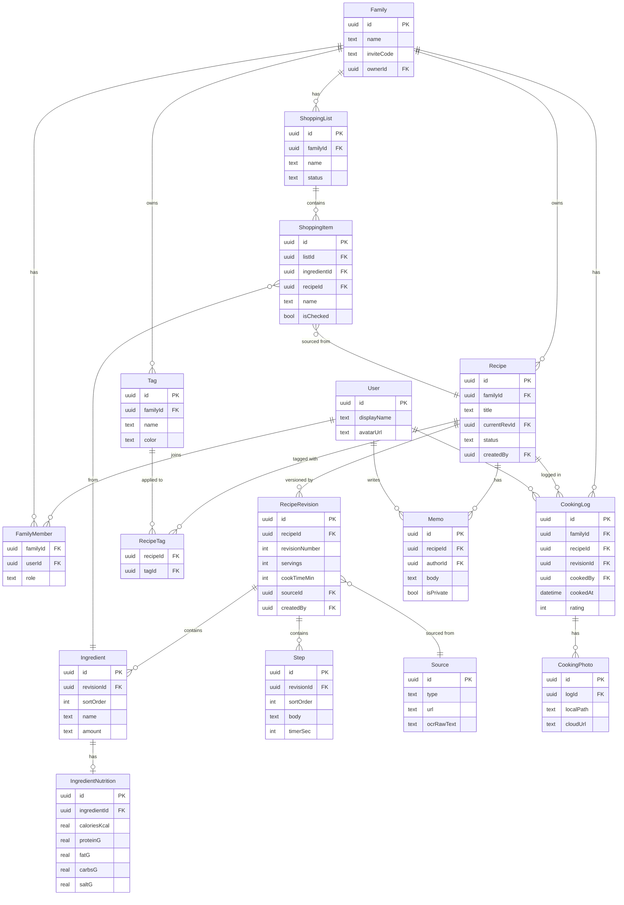

# だいどこ — データ設計書

> 改訂: 2026-05-04 (v2 — 買い物リスト・栄養情報を v1.0 対象に昇格、RecipeRevision に isMajor フラグを追加)  
> ステータス: Draft

---

## 1. 設計方針

- **ローカルファースト**: 全データはデバイス内SQLiteに保持し、クラウドは同期バックエンド
- **オフライン完結**: ネットワーク不在時もすべての読み書きが可能
- **家族スコープ**: データの共有単位は「家族グループ（Family）」。個人ノートのみ非共有
- **イミュータブルな変更履歴**: レシピ本体は更新せず、バージョン（RecipeRevision）を積み上げる
- **タイムライン**: 調理記録（CookingLog）がタイムラインの基本単位

---

## 2. エンティティ一覧

| エンティティ        | 説明                                          | 共有スコープ     |
| ------------------- | --------------------------------------------- | ---------------- |
| User                | アプリ利用者                                  | 個人             |
| Family              | 家族グループ                                  | グループ         |
| FamilyMember        | User ↔ Family の中間テーブル                  | グループ         |
| Recipe              | レシピのメタデータ（親）                      | グループ         |
| RecipeRevision      | レシピの内容バージョン                        | グループ         |
| Ingredient          | 材料行（RecipeRevision に属する）             | グループ         |
| Step                | 手順行（RecipeRevision に属する）             | グループ         |
| Tag                 | タグマスタ                                    | グループ         |
| RecipeTag           | Recipe ↔ Tag の中間テーブル                   | グループ         |
| Source              | 出典情報（URL / OCR / 手書き）                | グループ         |
| CookingLog          | 調理記録（タイムライン基本単位）              | グループ         |
| CookingPhoto        | 調理ログに添付した写真                        | グループ         |
| Memo                | レシピへのメモ・付箋                          | 個人 or グループ |
| ShoppingList        | 買い物リスト                                  | グループ         |
| ShoppingItem        | 買い物リストの1品                             | グループ         |
| IngredientNutrition | 材料の栄養情報                                | グループ         |
| SyncMeta            | 同期メタデータ（lastSyncedAt, vectorClock等） | 内部             |

---

## 3. エンティティ詳細

### 3.1 User

```
User {
  id          UUID        PK
  displayName TEXT        NOT NULL
  avatarUrl   TEXT        nullable
  createdAt   DATETIME    NOT NULL
  updatedAt   DATETIME    NOT NULL
}
```

### 3.2 Family

```
Family {
  id          UUID        PK
  name        TEXT        NOT NULL          -- 例: "佐藤家の台所"
  inviteCode  TEXT        UNIQUE NOT NULL   -- 招待コード（6桁英数字）
  ownerId     UUID        FK → User.id
  createdAt   DATETIME    NOT NULL
  updatedAt   DATETIME    NOT NULL
}
```

### 3.3 FamilyMember

```
FamilyMember {
  familyId    UUID        FK → Family.id   PK(複合)
  userId      UUID        FK → User.id     PK(複合)
  role        TEXT        NOT NULL          -- "owner" | "member"
  joinedAt    DATETIME    NOT NULL
}
```

### 3.4 Recipe

```
Recipe {
  id              UUID        PK
  familyId        UUID        FK → Family.id
  title           TEXT        NOT NULL
  titleReading    TEXT        nullable      -- よみがな（検索補助）
  currentRevId    UUID        FK → RecipeRevision.id  nullable
  status          TEXT        NOT NULL DEFAULT 'active'
                                            -- "active" | "archived"
  createdBy       UUID        FK → User.id
  createdAt       DATETIME    NOT NULL
  updatedAt       DATETIME    NOT NULL
}
```

**設計意図**: Recipe は「器」、内容は RecipeRevision で管理。
updatedAt は currentRevId が変わるたびに更新される。

### 3.5 RecipeRevision

```
RecipeRevision {
  id              UUID        PK
  recipeId        UUID        FK → Recipe.id
  revisionNumber  INTEGER     NOT NULL      -- 1始まりの連番
  isMajor         BOOLEAN     NOT NULL DEFAULT true
                                            -- false = 誤字修正などの軽微な変更
                                            -- Owner が保存時に選択
  servings        INTEGER     nullable      -- 何人前
  cookTimeMin     INTEGER     nullable      -- 調理時間（分）
  prepTimeMin     INTEGER     nullable      -- 下準備時間（分）
  description     TEXT        nullable      -- リード文・概要
  authorNote      TEXT        nullable      -- 作者メモ（非公開可）
  sourceId        UUID        FK → Source.id  nullable
  createdBy       UUID        FK → User.id
  createdAt       DATETIME    NOT NULL
}
```

**設計意図**: 編集のたびに新 Revision を INSERT。過去版は参照のみ。
`isMajor=false` の Revision は版履歴画面でデフォルト折り畳み表示し、
UI 上のバージョン番号は major Revision のみカウントする（例: v1, v2, v3）。
削除は Recipe.status = "archived" で論理削除。

### 3.6 Ingredient

```
Ingredient {
  id              UUID        PK
  revisionId      UUID        FK → RecipeRevision.id
  sortOrder       INTEGER     NOT NULL
  groupLabel      TEXT        nullable      -- 「A: 下味」などのグルーピング
  name            TEXT        NOT NULL      -- 食材名
  amount          TEXT        nullable      -- 分量（自由テキスト: "大さじ2", "適量"）
  note            TEXT        nullable      -- 補足（"薄切り" など）
}
```

### 3.7 Step

```
Step {
  id              UUID        PK
  revisionId      UUID        FK → RecipeRevision.id
  sortOrder       INTEGER     NOT NULL
  body            TEXT        NOT NULL      -- 手順テキスト
  timerSec        INTEGER     nullable      -- タイマー秒数（設定時のみ）
  photoId         UUID        nullable      -- 手順写真（CookingPhoto or 別テーブル検討）
}
```

### 3.8 Tag

```
Tag {
  id          UUID        PK
  familyId    UUID        FK → Family.id
  name        TEXT        NOT NULL
  color       TEXT        nullable      -- ラベルカラー (#hex)
  UNIQUE(familyId, name)
}
```

### 3.9 RecipeTag

```
RecipeTag {
  recipeId    UUID        FK → Recipe.id   PK(複合)
  tagId       UUID        FK → Tag.id      PK(複合)
}
```

### 3.10 Source

```
Source {
  id          UUID        PK
  type        TEXT        NOT NULL   -- "url" | "ocr" | "manual" | "photo"
  url         TEXT        nullable   -- type=url の場合
  ocrRawText  TEXT        nullable   -- type=ocr の場合（原文保持）
  siteName    TEXT        nullable   -- クローリング取得のサイト名
  pageTitle   TEXT        nullable
  thumbnailUrl TEXT       nullable
  capturedAt  DATETIME    nullable
  createdAt   DATETIME    NOT NULL
}
```

### 3.11 CookingLog

```
CookingLog {
  id              UUID        PK
  familyId        UUID        FK → Family.id
  recipeId        UUID        FK → Recipe.id  nullable  -- null=自由記録
  revisionId      UUID        FK → RecipeRevision.id  nullable
  cookedBy        UUID        FK → User.id
  cookedAt        DATETIME    NOT NULL          -- 調理した日時
  servings        INTEGER     nullable          -- 実際に作った人数
  rating          INTEGER     nullable          -- 1-5 の評価
  memo            TEXT        nullable          -- そのときのメモ
  createdAt       DATETIME    NOT NULL
}
```

### 3.12 CookingPhoto

```
CookingPhoto {
  id              UUID        PK
  logId           UUID        FK → CookingLog.id
  localPath       TEXT        NOT NULL   -- デバイス内パス
  cloudUrl        TEXT        nullable   -- アップロード後のURL
  sortOrder       INTEGER     NOT NULL
  takenAt         DATETIME    nullable
  createdAt       DATETIME    NOT NULL
}
```

### 3.13 Memo

```
Memo {
  id              UUID        PK
  recipeId        UUID        FK → Recipe.id
  authorId        UUID        FK → User.id
  body            TEXT        NOT NULL
  isPrivate       BOOLEAN     NOT NULL DEFAULT false
  createdAt       DATETIME    NOT NULL
  updatedAt       DATETIME    NOT NULL
}
```

### 3.14 ShoppingList

```
ShoppingList {
  id          UUID        PK
  familyId    UUID        FK → Family.id
  name        TEXT        NOT NULL DEFAULT '買い物リスト'
  status      TEXT        NOT NULL DEFAULT 'active'
                                    -- "active" | "done"
  createdBy   UUID        FK → User.id
  createdAt   DATETIME    NOT NULL
  updatedAt   DATETIME    NOT NULL
}
```

**設計意図**: レシピの材料から自動生成するほか、手動で品目を追加できる。
家族全員がリアルタイムに isChecked を更新し合う（買い物中の共同操作）。

### 3.15 ShoppingItem

```
ShoppingItem {
  id              UUID        PK
  listId          UUID        FK → ShoppingList.id
  ingredientId    UUID        FK → Ingredient.id  nullable
                                    -- null = 手動追加
  recipeId        UUID        FK → Recipe.id  nullable
                                    -- どのレシピ由来か（表示用）
  name            TEXT        NOT NULL
  amount          TEXT        nullable
  isChecked       BOOLEAN     NOT NULL DEFAULT false
  checkedBy       UUID        FK → User.id  nullable
  sortOrder       INTEGER     NOT NULL
  addedBy         UUID        FK → User.id
  createdAt       DATETIME    NOT NULL
}
```

**設計意図**: 複数レシピの材料をまとめて1リストに集約できる。
同一食材（例: 玉ねぎ）は UI 側でグルーピング表示するが、DB では別行で保持。

### 3.16 IngredientNutrition

```
IngredientNutrition {
  id              UUID        PK
  ingredientId    UUID        FK → Ingredient.id  UNIQUE
  caloriesKcal    REAL        nullable
  proteinG        REAL        nullable
  fatG            REAL        nullable
  carbsG          REAL        nullable
  saltG           REAL        nullable   -- 食塩相当量
  dataSource      TEXT        NOT NULL DEFAULT 'manual'
                                         -- "manual" | "api" | "estimated"
  updatedAt       DATETIME    NOT NULL
}
```

**設計意図**: Ingredient と 1:1 の別テーブルとして持つことで、
栄養情報が未入力でも Ingredient の取得に影響しない。
将来的には食品成分 API との連携で自動補完する。
RecipeRevision レベルで合計カロリーは VIEW で算出（非正規化しない）。

### 3.17 SyncMeta

```
SyncMeta {
  entityType      TEXT        PK(複合)   -- テーブル名
  entityId        UUID        PK(複合)
  vectorClock     TEXT        NOT NULL   -- JSON形式 {"userId": seq}
  deletedAt       DATETIME    nullable   -- 論理削除タイムスタンプ
  lastSyncedAt    DATETIME    nullable
}
```

---

## 4. ER図



---

## 5. インデックス設計

| テーブル       | インデックス対象           | 用途             |
| -------------- | -------------------------- | ---------------- |
| Recipe         | (familyId, status)         | 一覧取得         |
| Recipe         | (familyId, updatedAt DESC) | 最近更新順ソート |
| Recipe         | title, titleReading        | 全文検索（FTS5） |
| RecipeRevision | (recipeId, revisionNumber) | 版一覧           |
| Ingredient     | revisionId                 | レシピ詳細取得   |
| Step           | revisionId                 | レシピ詳細取得   |
| CookingLog     | (familyId, cookedAt DESC)  | タイムライン     |
| CookingLog     | (recipeId, cookedAt DESC)  | レシピ別調理履歴 |
| Memo           | recipeId                   | レシピ別メモ     |
| RecipeTag      | recipeId                   | レシピのタグ取得 |
| RecipeTag      | tagId                      | タグ別レシピ一覧 |

---

## 6. 全文検索

SQLite の **FTS5** を使用。

```sql
CREATE VIRTUAL TABLE recipe_fts USING fts5(
  recipeId UNINDEXED,
  title,
  titleReading,
  ingredientNames,   -- Ingredient.name を連結して格納
  content='Recipe',
  tokenize='unicode61'
);
```

- レシピ保存時に `recipe_fts` をトリガーで更新
- 検索クエリはひらがな・カタカナ正規化してから投入

---

## 7. 同期・競合解決方針

| ケース                           | 解決方法                                            |
| -------------------------------- | --------------------------------------------------- |
| 同一レシピを別デバイスで同時編集 | RecipeRevision を両方 INSERT → ユーザーに選択肢提示 |
| タグの重複追加                   | UNIQUE 制約 + 冪等 INSERT OR IGNORE                 |
| CookingLog の競合                | サーバータイムスタンプ優先（last-write-wins）       |
| Memo の競合                      | Vector clock で検出 → マージ画面表示                |
| 論理削除 vs 更新                 | deletedAt がある方を優先                            |

---

## 8. ローカルストレージ構成

```
{app_data}/
├── db/
│   └── daidoko.sqlite        # メインDB
├── photos/
│   ├── cooking/              # 調理写真
│   └── steps/                # 手順写真
└── sync/
    └── queue.sqlite          # 同期キュー（未送信の差分）
```

---

## 9. 将来拡張メモ

| 項目          | 概要                                              |
| ------------- | ------------------------------------------------- |
| 音声メモ      | Memo に audioPath カラムを追加                    |
| 栄養 API 連携 | IngredientNutrition.dataSource = "api" で自動補完 |
| 買い物 AI     | ShoppingItem の購入パターンから自動サジェスト     |
| AIサジェスト  | CookingLog の rating 集計をもとにレコメンド       |
