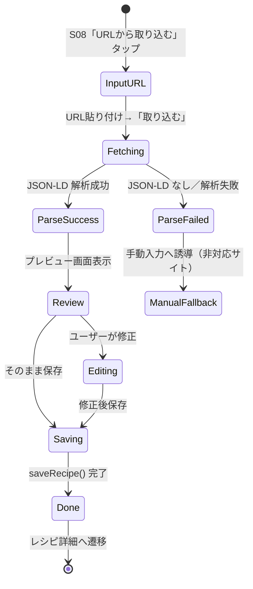
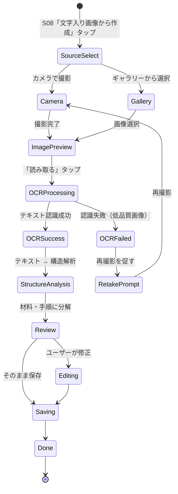
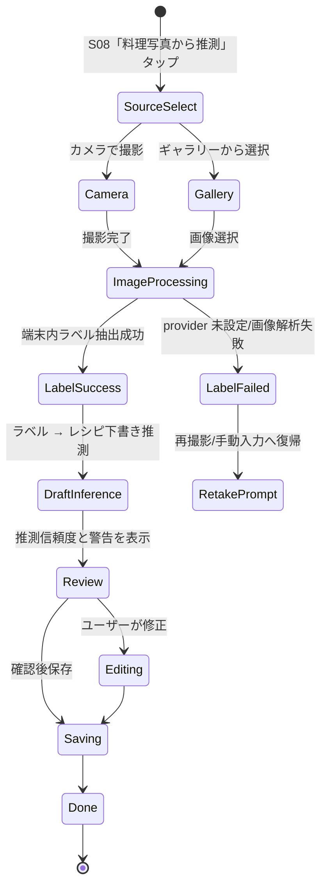
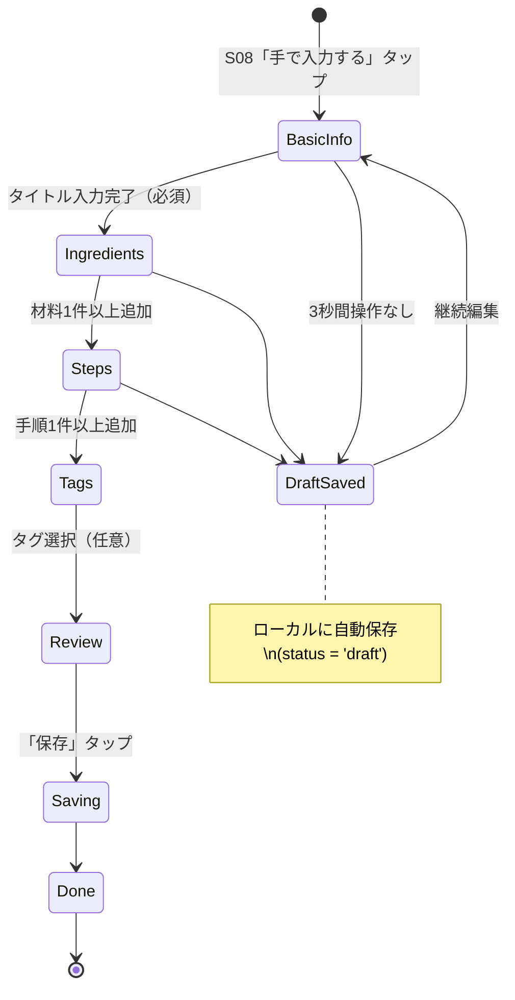
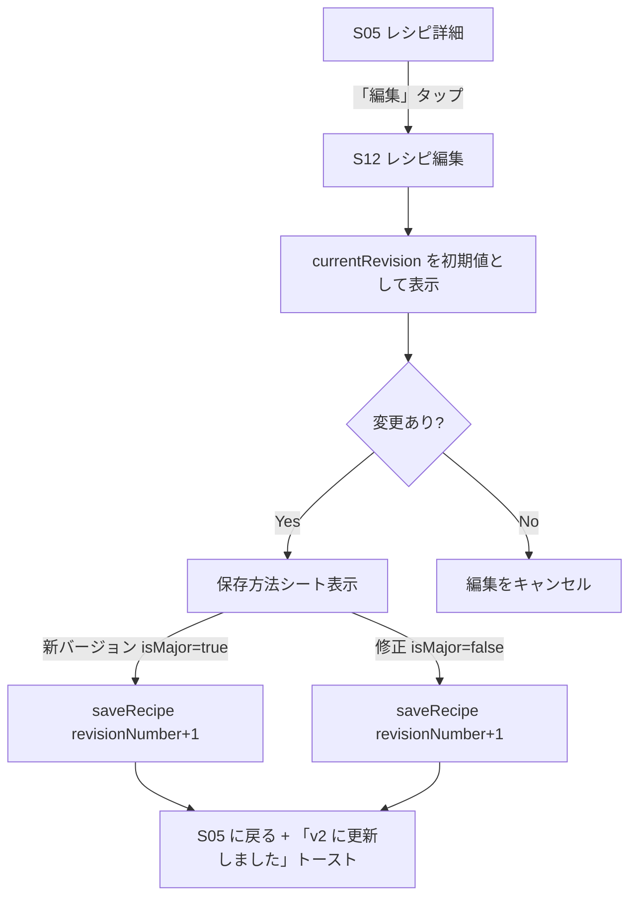

# だいどこ — レシピ作成フロー・ロジック設計書

> 改訂: 2026-05-04  
> ステータス: Draft

---

## 1. 概要

レシピ作成には5つの入力方式がある。いずれも最終的に同一の `saveRecipe()` ロジックを通じて `Recipe` + `RecipeRevision` を生成する。

| 方式             | 画面 | 優先度 | 自動化度                         |
| ---------------- | ---- | ------ | -------------------------------- |
| URL 取り込み     | S09  | P1     | 高（JSON-LD 解析）               |
| OCR 取り込み     | S10  | P1     | 中（テキスト解析が必要）         |
| テキスト取り込み | S10a | P0     | 中（貼り付けテキストの構造解析） |
| 料理写真推測     | S10b | P1     | 低〜中（見た目から下書き推測）   |
| 手動入力         | S11  | P0     | 低（ユーザーが全入力）           |

---

## 2. 共通：レシピ保存ロジック

### 2.1 `saveRecipe()` の引数型

```typescript
interface SaveRecipeInput {
  // Recipe レベル
  familyId: string;
  title: string;
  titleReading?: string;
  tags?: string[]; // タグ名（存在しなければ自動作成）

  // RecipeRevision レベル
  servings?: number;
  cookTimeMin?: number;
  prepTimeMin?: number;
  description?: string;
  authorNote?: string;
  sourceId?: string; // Source.id（URL/OCR/料理写真 取り込み時に事前生成）

  ingredients: IngredientInput[];
  steps: StepInput[];

  // 編集時のみ
  recipeId?: string; // 既存レシピの場合は指定
  isMajor?: boolean; // デフォルト true
}

interface IngredientInput {
  groupLabel?: string;
  name: string;
  amount?: string;
  note?: string;
}

interface StepInput {
  body: string;
  timerSec?: number;
}
```

### 2.2 保存トランザクション

```typescript
async function saveRecipe(input: SaveRecipeInput): Promise<string> {
  return db.transaction(async (tx) => {
    // 1. Recipe を取得 or 新規作成
    let recipeId = input.recipeId;
    if (!recipeId) {
      recipeId = generateId();
      await tx.insert(recipes).values({
        id: recipeId,
        familyId: input.familyId,
        title: input.title,
        titleReading: input.titleReading,
        status: 'active',
        createdBy: currentUserId(),
      });
    }

    // 2. 現在の最大 revisionNumber を取得
    const [latest] = await tx
      .select({ n: max(recipeRevisions.revisionNumber) })
      .from(recipeRevisions)
      .where(eq(recipeRevisions.recipeId, recipeId));
    const nextRevNum = (latest?.n ?? 0) + 1;

    // 3. RecipeRevision を INSERT
    const revisionId = generateId();
    await tx.insert(recipeRevisions).values({
      id: revisionId,
      recipeId,
      revisionNumber: nextRevNum,
      isMajor: input.isMajor ?? true,
      servings: input.servings,
      cookTimeMin: input.cookTimeMin,
      prepTimeMin: input.prepTimeMin,
      description: input.description,
      authorNote: input.authorNote,
      sourceId: input.sourceId,
      createdBy: currentUserId(),
    });

    // 4. Ingredient を INSERT（sortOrder は配列順）
    for (const [i, ing] of input.ingredients.entries()) {
      await tx.insert(ingredients).values({
        id: generateId(),
        revisionId,
        sortOrder: i,
        groupLabel: ing.groupLabel,
        name: ing.name,
        amount: ing.amount,
        note: ing.note,
      });
    }

    // 5. Step を INSERT
    for (const [i, step] of input.steps.entries()) {
      await tx.insert(steps).values({
        id: generateId(),
        revisionId,
        sortOrder: i,
        body: step.body,
        timerSec: step.timerSec,
      });
    }

    // 6. Recipe.currentRevId を更新
    await tx
      .update(recipes)
      .set({ currentRevId: revisionId, updatedAt: new Date() })
      .where(eq(recipes.id, recipeId));

    // 7. タグを UPSERT して RecipeTag を更新
    if (input.tags?.length) {
      await upsertTags(tx, input.familyId, recipeId, input.tags);
    }

    // 8. FTS インデックスを更新
    await updateFts(tx, recipeId, revisionId, input);

    // 9. 同期キューに積む
    await enqueueSyncItem(tx, 'Recipe', recipeId, 'UPSERT');
    await enqueueSyncItem(tx, 'RecipeRevision', revisionId, 'INSERT');

    return recipeId;
  });
}
```

### 2.3 isMajor 判定 UI

保存ボタン長押し or 保存シート表示時に選択肢を提示する。

```
┌─────────────────────────┐
│  保存方法を選択         │
├─────────────────────────┤
│ ● 新しいバージョンとして保存 │  ← isMajor = true（デフォルト）
│   改良・変更時に使用    │
│                         │
│ ○ 修正として保存        │  ← isMajor = false
│   誤字・微調整時に使用  │
├─────────────────────────┤
│       [   保存   ]      │
└─────────────────────────┘
```

---

## 3. URL 取り込みフロー

### 3.1 状態遷移図



### 3.2 対応サイト方針

**v1.0 の対応範囲: JSON-LD（`@type: "Recipe"`）を実装しているサイトのみ**

ヒューリスティック解析・microdata フォールバックは実装しない。JSON-LD がない場合は即座に `UNSUPPORTED_SITE` エラーを返し、手動入力へ誘導する。

| サイト                                | JSON-LD     | v1.0 対応     | 備考                           |
| ------------------------------------- | ----------- | ------------- | ------------------------------ |
| クラシル (kurashiru.com)              | ✅          | ✅            | HowToStep 形式                 |
| デリッシュキッチン (delishkitchen.tv) | ✅          | ✅            |                                |
| Nadia (oceans-nadia.com)              | ✅          | ✅            |                                |
| NHK きょうの料理                      | △ microdata | ❌ **対象外** | JSON-LD なし                   |
| クックパッド (cookpad.com)            | △ 部分的    | ❌ **対象外** | Bot 検知あり・構造不安定       |
| 個人ブログ等                          | ❌          | ❌            | ヒューリスティック不採用のため |

非対応サイトには「このサイトからは自動取り込みできません。手動で入力するか、OCR取り込みをお試しください。」と表示する。

### 3.3 URL バリデーション

```typescript
const URL_RULES = {
  maxLength: 2048,
  allowedSchemes: ['https', 'http'],
  blockedDomains: [], // 将来的に悪用 URL をブロック
};

function validateImportUrl(url: string): ValidationResult {
  if (!url.startsWith('http')) return { ok: false, error: 'URLはhttp/httpsで始めてください' };
  if (url.length > URL_RULES.maxLength) return { ok: false, error: 'URLが長すぎます' };
  return { ok: true };
}
```

### 3.4 サーバーサイドパース（`/api/v1/import/url`）

```typescript
// server/src/routes/import.ts
interface ParsedRecipe {
  title: string;
  description?: string;
  servings?: number;
  cookTimeMin?: number;
  prepTimeMin?: number;
  ingredients: { name: string; amount?: string }[];
  steps: { body: string }[];
  imageUrl?: string;
  sourceName?: string;
  parseMethod: 'json-ld' | 'microdata' | 'heuristic';
  confidence: number; // 0.0〜1.0
}

async function parseRecipeFromUrl(url: string): Promise<ParsedRecipe> {
  const html = await fetchWithTimeout(url, { timeoutMs: 10_000 });

  // 優先度 1: JSON-LD
  const jsonLd = extractJsonLd(html);
  if (jsonLd?.['@type'] === 'Recipe') {
    return mapJsonLdToRecipe(jsonLd, url);
  }

  // 優先度 2〜3 のフォールバックは v1.0 では実装しない。
  // JSON-LD が存在しないサイトはエラーレスポンスを返し、手動入力へ誘導する。
  throw new ImportError('UNSUPPORTED_SITE');
}
```

### 3.5 プレビュー画面 UI

```
┌─────────────────────────┐
│ ←  URL から取り込み     │
│ 取り込み元: クラシル    │  ← siteName
├─────────────────────────┤
│ タイトル                │
│ ┌─────────────────────┐ │
│ │ 肉じゃが            │ │  ← 編集可能
│ └─────────────────────┘ │
│                         │
│ 材料（8品目）           │  ← 折り畳み可
│   じゃがいも  3個       │
│   玉ねぎ     1個       │
│   ...                   │
│                         │
│ 手順（5ステップ）       │  ← 折り畳み可
│   1. じゃがいもは…     │
│   ...                   │
│                         │
│                         │  ← 警告表示なし（JSON-LD のみ対応）
├─────────────────────────┤
│ [編集して保存] [そのまま保存] │
└─────────────────────────┘
```

---

## 4. OCR 取り込みフロー

### 4.0 方針レビュー結果（2026-05-27）

当初方針「端末内 OCR → ルールベース parser → `RecipeForm` で確認」は妥当。ただし実装前レビューで以下を補強する。

| 指摘 ID | 指摘                                                                     | 反映方針                                                                                                                                            |
| ------- | ------------------------------------------------------------------------ | --------------------------------------------------------------------------------------------------------------------------------------------------- |
| OCR-R1  | OCR 専用 parser を増やすと S10a テキスト取り込みと分岐して保守負荷が高い | OCR は前処理・正規化までを専用化し、構造解析は既存 `parseRecipeTextWithAssistance()` に集約する                                                     |
| OCR-R2  | Source テーブルは存在するが保存経路が未接続                              | `SaveRecipeInput.sourceId` を追加し、OCR 保存時は `Source(type='ocr', ocrRawText, capturedAt)` を作成して `RecipeRevision.sourceId` に紐付ける      |
| OCR-R3  | カメラ実装は調理記録写真でも必要                                         | 撮影・ギャラリー選択・一時ファイル管理は `PhotoCaptureService` として共通化し、OCR と料理記録写真の双方から使う                                     |
| OCR-R4  | ネイティブ依存を画面や parser に直接入れるとテスト不能になる             | `OcrProvider` 境界を作り、ML Kit / Vision の実装は provider の内側へ閉じ込める。ユニットテストは provider mock で行う                               |
| OCR-R5  | 実装とテストの追跡性が弱い                                               | 品質基準 §2.4 に OCR テスト設計と Trace ID を定義し、テスト名・PR 説明・E2E 結果に Trace ID を残す                                                  |
| OCR-R6  | サーバー OCR / サーバー AI 構造化は体感遅延が大きく、取り込み体験を壊す  | A2 の同期 OCR 経路は端末内 provider のみに固定する。サーバー fallback や `useServerAI` は設けず、低信頼時は再撮影・手動入力・テキスト貼り付けへ戻す |

### 4.1 状態遷移図



### 4.2 OCR 処理

A2 の同期 OCR 経路は端末内 `OcrProvider` を必須依存にする。画像認識・OCR 正規化・構造解析はクライアント内で完結させ、サーバー AI への fallback は入れない。provider が未設定、低信頼、または parser が `RecipeForm` schema を満たせない場合は、ネットワークへ逃がさずに再撮影・手動入力・テキスト貼り付けへ誘導する。

```typescript
// services/ocr.service.ts
interface ClientOcrProvider {
  recognize(imageUri: string): Promise<OcrRecognitionResult>;
}

interface OcrRecognitionResult {
  rawText: string;
  blocks: OcrTextBlock[];
  confidence: 'high' | 'medium' | 'low';
  warnings: string[];
}

async function runOcrPipeline(input: { imageUri: string; provider: ClientOcrProvider }) {
  const processed = await preprocessImageForOcr(input.imageUri);
  const recognized = await input.provider.recognize(processed.imageUri);

  if (recognized.rawText.trim().length < 20) {
    throw new OcrError('OCR_FAILED', 'テキストが少なすぎます。より鮮明な画像で試してください。');
  }

  const normalizedText = normalizeOcrText(recognized.rawText);
  const parsed = await parseRecipeTextWithAssistance(normalizedText, { targetConfidence: 'high' });

  return { processed, recognized, normalizedText, parsed };
}
```

実装レイヤー:

| レイヤー | ファイル                                              | 責務                                                                     |
| -------- | ----------------------------------------------------- | ------------------------------------------------------------------------ |
| 画面     | `app/(tabs)/recipes/import-ocr.tsx`                   | 状態遷移、権限導線、画像プレビュー、`RecipeForm` への接続                |
| 撮影     | `src/services/photo-capture.service.ts`               | カメラ撮影、ギャラリー選択、一時ファイル cleanup。調理記録写真でも再利用 |
| 前処理   | `src/services/image-preprocess.service.ts`            | リサイズ、回転補正、圧縮、品質警告                                       |
| OCR      | `src/services/ocr.service.ts`                         | OCR テキスト正規化、品質判定、parser 接続                                |
| Agent    | `src/agents/ocr.agent.ts`                             | A2 runner。`AgentBridge.call('A2')` から呼び出せる契約を提供             |
| 保存     | `src/services/source.service.ts`, `recipe.service.ts` | OCR raw text を Source として保存し、RecipeRevision.sourceId に紐付け    |

v1.0 では画像は保存後に破棄する。永続化するのは `ocrRawText` と `Source` メタデータのみ。画像履歴・再 OCR は v1.1 以降で `Source.localImagePath` または `ocrMetaJson` の追加を検討する。

### 4.3 テキスト構造解析

OCR で得られた生テキストは、そのまま保存せず、まず OCR 正規化を通してから S10a と同じ `parseRecipeTextWithAssistance()` に流す。これにより「テキスト貼り付け」と「写真 OCR」の保存品質・テスト資産を共有する。

```typescript
interface ParsedOcrRecipe {
  title?: string;
  ingredients: { name: string; amount?: string }[];
  steps: { body: string }[];
  unparsedLines: string[]; // 分類できなかった行
}

function normalizeOcrText(rawText: string): string {
  return rawText
    .replace(/\r/g, '\n')
    .replace(/[\t　]+/g, ' ')
    .replace(/([材料作り方手順])\s+[:：]/g, '$1:')
    .split('\n')
    .map((line) => line.trim())
    .filter(Boolean)
    .join('\n');
}
```

OCR 正規化は分類ロジックを持ちすぎない。分類は既存 parser が担当する。OCR 正規化が担当してよいのは、空白揺れ、改行崩れ、見出し記号、ページ番号・ノイズ除去、分量行の軽微な修復までとする。解析後は必ず `RecipeForm` で確認・編集してから保存する。

S10a は、ユーザーが外部の生成AIへ投げるための整形指示テンプレートをコピーできる。テンプレートは JSON や表ではなく、parser が読み取りやすい「料理名」「人数」「材料」「作り方」「メモ」のプレーンテキスト出力を求める。

#### 4.3.1 端末内 AI 補正（Experimental）

自由文 parser は、まず決定的なルールベース解析を行い、`confidence` が目標値に届かない場合のみ補正 provider を順に試す。

1. `gemma-native`: React Native の `NativeModules.DaidokoRecipeTextLlm` 経由で端末内 Gemma 系モデルを呼ぶ optional provider。モデルファイルや推論ランタイムはアプリ本体に直結せず、provider 境界の内側に閉じ込める。
2. `local-heuristic`: モデルがない端末でも動く軽量補正 provider。短い自由文から材料・分量・手順らしい文を parser-friendly なプレーンテキストへ整形する。

補正 provider の出力はそのまま保存しない。必ず既存 `parseRecipeText()` に再投入し、`RecipeForm` の Zod schema で検証し、元の解析より信頼度または抽出件数が改善した場合だけ採用する。失敗時は元の parser 結果を維持し、ユーザーの確認・編集画面へ進める。

モデルファイルはリポジトリに含めない。ローカル検証では `apps/mobile/android/app/src/main/assets/models/` または端末内 app files の `models/` 配下に配置し、ビルド flavor や配布チャネルごとに provisioning する。

補正 provider もクライアント内に限定する。同期 OCR 体験では、サーバー AI に問い合わせて精度を上げる経路は作らない。

### 4.4 画像品質チェック

```typescript
function checkImageQuality(imagePath: string): QualityWarning[] {
  const warnings: QualityWarning[] = [];
  // expo-image-manipulator で解像度確認
  // 幅 < 800px → 「画像が小さすぎます」
  // 明度が極端に低い → 「画像が暗すぎます」
  return warnings;
}
```

品質警告は保存をブロックしない。警告がある場合も、認識テキストが 20 文字以上あり、parser が `RecipeForm` schema を満たす下書きを返せるならレビューへ進める。失敗時は「再撮影」「手動入力」「テキスト貼り付け」の 3 導線を出す。

### 4.5 Traceability

OCR 実装では、以下の Trace ID をテスト名・PR 説明・E2E 結果に残す。

| Trace ID   | 要件                                                            | 主な実装                                           | テスト                                        |
| ---------- | --------------------------------------------------------------- | -------------------------------------------------- | --------------------------------------------- |
| OCR-REQ-01 | カメラまたはギャラリーから画像を選べる                          | `PhotoCaptureService`, `import-ocr.tsx`            | `OCR-UI-01`, `OCR-E2E-01`                     |
| OCR-REQ-02 | 画像を端末内で前処理し OCR に渡す                               | `ImagePreprocessService`                           | `OCR-SVC-01`, `OCR-E2E-02`                    |
| OCR-REQ-03 | OCR raw text を parser-friendly text に正規化する               | `normalizeOcrText()`                               | `OCR-SVC-02`                                  |
| OCR-REQ-04 | 既存テキスト parser と同じ保存下書きへ変換する                  | `runOcrAgent()`, `parseRecipeTextWithAssistance()` | `OCR-AGT-01`, 既存 `recipeTextParser.test.ts` |
| OCR-REQ-05 | 保存時に Source(type=ocr) と RecipeRevision.sourceId を紐付ける | `source.service.ts`, `recipe.service.ts`           | `OCR-SVC-03`                                  |
| OCR-REQ-06 | OCR 失敗時に再撮影・手動入力へ復帰できる                        | `import-ocr.tsx`                                   | `OCR-UI-02`, `OCR-E2E-03`                     |
| OCR-REQ-07 | 同期 OCR 経路で画像・OCR テキストをサーバー処理へ送信しない     | `ClientOcrProvider` 境界、A2                       | `OCR-SEC-01`                                  |

---

## 5. 料理写真から推測フロー

料理写真推測は OCR とは別機能として扱う。OCR は画像内の文字を読む機能、料理写真推測は写真に写っている料理・食材のラベルから、編集前提のレシピ下書きを作る機能である。

写真だけでは分量、隠れた調味料、火入れ時間、正確な手順を確定できない。そのため v1.0 の料理写真推測は「保存可能な完成レシピ」ではなく、必ず `RecipeForm` で確認・編集してから保存する低信頼下書きとして提供する。

### 5.1 状態遷移図



### 5.2 処理方針

同期経路はクライアント内に限定する。Android は ML Kit Image Labeling、iOS は Apple Vision または同等のオンデバイス provider を使用する。サーバー AI / サーバー画像解析 fallback は入れない。

```typescript
interface ClientImageLabelProvider {
  labelImage(imageUri: string): Promise<{ text: string; confidence: number }[]>;
}

async function runPhotoRecipePipeline(input: {
  imageUri: string;
  provider: ClientImageLabelProvider;
}) {
  const processed = await preprocessImageForOcr(input.imageUri);
  const labels = await input.provider.labelImage(processed.imageUri);
  const inferred = inferRecipeFromPhotoLabels(labels);

  return {
    draft: inferred.draft,
    confidence: inferred.confidence,
    warnings: ['写真だけでは分量・加熱時間・隠れた調味料を確定できません', ...inferred.warnings],
  };
}
```

下書き生成の制約:

- 料理名が特定できる場合でも `confidence` は原則 `medium` までに留める
- 料理名が特定できない場合は `料理写真からのレシピ案` として汎用下書きを出す
- 材料には「写真を見て確認」など確認前提の名称を含める
- 警告バナーを `RecipeForm` 上部に表示し、保存前に編集できる状態にする
- 画像本体は保存しない。保存するのは `Source(type='photo')` とラベル要約のみ

### 5.3 実装レイヤー

| レイヤー | ファイル                                                           | 責務                                                                          |
| -------- | ------------------------------------------------------------------ | ----------------------------------------------------------------------------- |
| 画面     | `app/(tabs)/recipes/import-photo.tsx`                              | 状態遷移、権限導線、画像プレビュー、`RecipeForm` への接続                     |
| 撮影     | `src/services/photo-capture.service.ts`                            | カメラ撮影、ギャラリー選択、一時ファイル cleanup                              |
| 前処理   | `src/services/image-preprocess.service.ts`                         | リサイズ、回転補正、圧縮、品質警告                                            |
| provider | `src/services/client-image-label.provider.ts`                      | NativeModules 経由で端末内画像ラベル抽出を呼び出す                            |
| 推測     | `src/services/recipe-photo-inference.service.ts`                   | 画像ラベルから `RecipeFormData` の低信頼下書きを生成                          |
| Agent    | `src/agents/recipe-photo.agent.ts`                                 | A2 の料理写真推測 runner。provider 未設定時はサーバー fallback せず失敗を返す |
| 保存     | `src/services/source.service.ts`, `src/services/recipe.service.ts` | `Source(type='photo')` と RecipeRevision.sourceId を紐付ける                  |

### 5.4 Traceability

| Trace ID          | 要件                                                              | 主な実装                                                       | テスト                                   |
| ----------------- | ----------------------------------------------------------------- | -------------------------------------------------------------- | ---------------------------------------- |
| IMG-RECIPE-REQ-01 | カメラまたはギャラリーから料理写真を選べる                        | `PhotoCaptureService`, `import-photo.tsx`                      | `IMG-RECIPE-E2E-02`, `IMG-RECIPE-E2E-03` |
| IMG-RECIPE-REQ-02 | 画像ラベルを端末内 provider から取得する                          | `client-image-label.provider.ts`, native module                | `IMG-RECIPE-AGT-01`, `IMG-RECIPE-E2E-01` |
| IMG-RECIPE-REQ-03 | ラベルから確認前提の `RecipeFormData` 下書きを作る                | `recipe-photo-inference.service.ts`                            | `IMG-RECIPE-SVC-01`                      |
| IMG-RECIPE-REQ-04 | provider 未設定/失敗時にサーバー AI fallback を使わない           | `recipe-photo.agent.ts`                                        | `IMG-RECIPE-AGT-02`, `IMG-RECIPE-SEC-01` |
| IMG-RECIPE-REQ-05 | 保存時に Source(type=photo) と RecipeRevision.sourceId を紐付ける | `source.service.ts`, `recipe.service.ts`                       | `recipe.service.test.ts`                 |
| IMG-RECIPE-REQ-06 | 同梱生成画像で実機推測プレビューを検証できる                      | `assets/e2e/food-photo-ja.png`, `android-photo-recipe-e2e.mjs` | `IMG-RECIPE-E2E-01`                      |

---

## 6. 手動入力フロー

### 6.1 状態遷移図



### 6.2 下書き自動保存

```typescript
// hooks/useRecipeDraft.ts
const DRAFT_KEY = 'recipe_draft';
const AUTOSAVE_DELAY_MS = 3000;

function useRecipeDraft() {
  const [draft, setDraft] = useState<Partial<SaveRecipeInput>>({});
  const saveTimerRef = useRef<ReturnType<typeof setTimeout>>();

  const updateDraft = useCallback(
    (partial: Partial<SaveRecipeInput>) => {
      const next = { ...draft, ...partial };
      setDraft(next);

      // デバウンスで 3 秒後に保存
      clearTimeout(saveTimerRef.current);
      saveTimerRef.current = setTimeout(() => {
        AsyncStorage.setItem(DRAFT_KEY, JSON.stringify(next));
      }, AUTOSAVE_DELAY_MS);
    },
    [draft],
  );

  // 画面マウント時に下書き復元
  useEffect(() => {
    AsyncStorage.getItem(DRAFT_KEY).then((saved) => {
      if (saved) setDraft(JSON.parse(saved));
    });
    return () => clearTimeout(saveTimerRef.current);
  }, []);

  const clearDraft = () => AsyncStorage.removeItem(DRAFT_KEY);

  return { draft, updateDraft, clearDraft };
}
```

### 6.3 バリデーションルール

| フィールド         | ルール                       | エラーメッセージ                                  |
| ------------------ | ---------------------------- | ------------------------------------------------- |
| title              | 必須・1〜100文字             | 「レシピ名を入力してください」                    |
| ingredients        | 任意。name は 1〜50文字      | 「食材名が長すぎます」                            |
| ingredients.amount | 任意・1〜30文字              | 「分量の形式を確認してください」                  |
| steps              | 任意。body は 1〜500文字     | 「手順が長すぎます」                              |
| servings           | 任意・1〜99                  | 「人数は1〜99で入力してください」                 |
| cookTimeMin        | 任意・1〜999                 | 「調理時間を確認してください」                    |
| titleReading       | 任意・ひらがな・カタカナのみ | 「よみがなはひらがな/カタカナで入力してください」 |

保存ボタンは title が入力されるまで非活性。material・step は 0 件でも保存可能（「材料未設定」状態として保存する）。

### 6.4 タグ入力 UI

```
┌─────────────────────────┐
│ タグ                    │
│ [肉 ✕][定番 ✕][煮物 ✕] │  ← 選択済みタグ
│ [＋ タグを追加]         │
├─────────────────────────┤
│ よく使うタグ            │
│ [肉][魚][野菜][汁物]    │
│ [ご飯][洋食][定番]      │
│                         │
│ 新規作成: "______"      │  ← テキスト入力→Enterで作成
└─────────────────────────┘
```

タグ名は Family スコープで共有。同一名のタグが存在する場合は UNIQUE 制約により自動的に既存タグに紐付く（`INSERT OR IGNORE`）。

---

## 7. 編集フロー（RecipeRevision 更新）

既存レシピの「編集」は、新しい RecipeRevision を生成する。



**重要**: 既存の RecipeRevision の内容を直接 UPDATE することは禁止。必ず新しい Revision を INSERT すること。これにより「いつ・誰が・何を変えたか」の完全な履歴が保持される。

---

## 8. エラーハンドリング一覧

| エラー種別              | 発生箇所       | ユーザー向け表示                                               | リカバリー         |
| ----------------------- | -------------- | -------------------------------------------------------------- | ------------------ |
| URL タイムアウト        | URL 取り込み   | 「サイトへの接続がタイムアウトしました」                       | 再試行ボタン       |
| URL パース失敗          | URL 取り込み   | 「このサイトからは取り込めませんでした」                       | 手動入力へ誘導     |
| OCR 認識失敗            | OCR 取り込み   | 「文字を読み取れませんでした。より鮮明な画像で試してください」 | 再撮影             |
| DB トランザクション失敗 | saveRecipe()   | 「保存に失敗しました」                                         | 下書きは保持       |
| ネットワーク同期失敗    | SyncService    | トップバーに非侵襲バナー（サイレント）                         | 次回起動時に再試行 |
| タイトル空欄            | バリデーション | インライン赤テキスト                                           | 入力促す           |
