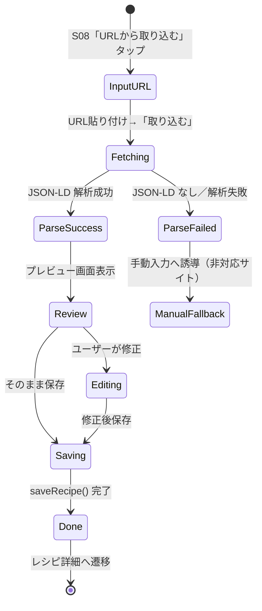
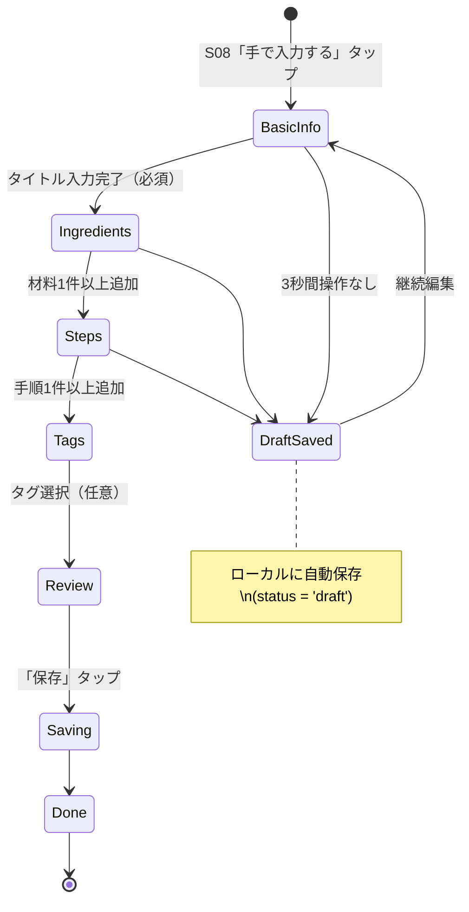
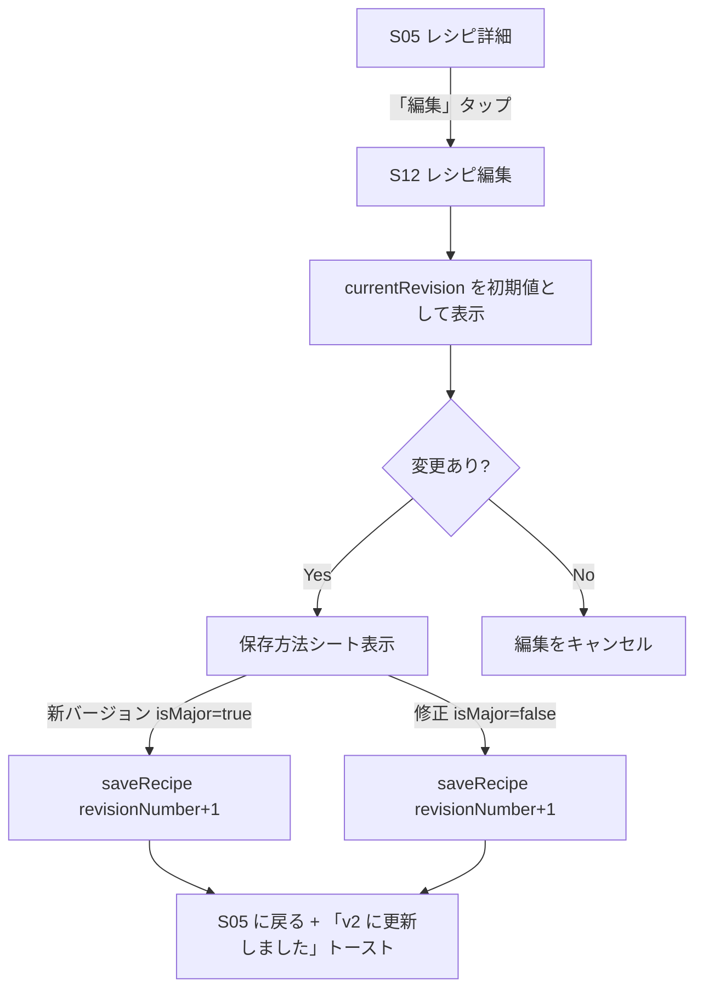

# だいどこ — レシピ作成フロー・ロジック設計書

> 改訂: 2026-05-04  
> ステータス: Draft

---

## 1. 概要

レシピ作成には3つの入力方式がある。いずれも最終的に同一の `saveRecipe()` ロジックを通じて `Recipe` + `RecipeRevision` を生成する。

| 方式         | 画面 | 優先度 | 自動化度                 |
| ------------ | ---- | ------ | ------------------------ |
| URL 取り込み | S09  | P1     | 高（JSON-LD 解析）       |
| OCR 取り込み | S10  | P1     | 中（テキスト解析が必要） |
| 手動入力     | S11  | P0     | 低（ユーザーが全入力）   |

---

## 2. 共通：レシピ保存ロジック

### 2.1 `saveRecipe()` の引数型

```typescript
interface SaveRecipeInput {
  // Recipe レベル
  familyId: string;
  title: string;
  titleReading?: string;
  tags?: string[]; // タグ名（存在しなければ自動作成）

  // RecipeRevision レベル
  servings?: number;
  cookTimeMin?: number;
  prepTimeMin?: number;
  description?: string;
  authorNote?: string;
  sourceId?: string; // Source.id（URL/OCR 取り込み時に事前生成）

  ingredients: IngredientInput[];
  steps: StepInput[];

  // 編集時のみ
  recipeId?: string; // 既存レシピの場合は指定
  isMajor?: boolean; // デフォルト true
}

interface IngredientInput {
  groupLabel?: string;
  name: string;
  amount?: string;
  note?: string;
}

interface StepInput {
  body: string;
  timerSec?: number;
}
```

### 2.2 保存トランザクション

```typescript
async function saveRecipe(input: SaveRecipeInput): Promise<string> {
  return db.transaction(async (tx) => {
    // 1. Recipe を取得 or 新規作成
    let recipeId = input.recipeId;
    if (!recipeId) {
      recipeId = generateId();
      await tx.insert(recipes).values({
        id: recipeId,
        familyId: input.familyId,
        title: input.title,
        titleReading: input.titleReading,
        status: 'active',
        createdBy: currentUserId(),
      });
    }

    // 2. 現在の最大 revisionNumber を取得
    const [latest] = await tx
      .select({ n: max(recipeRevisions.revisionNumber) })
      .from(recipeRevisions)
      .where(eq(recipeRevisions.recipeId, recipeId));
    const nextRevNum = (latest?.n ?? 0) + 1;

    // 3. RecipeRevision を INSERT
    const revisionId = generateId();
    await tx.insert(recipeRevisions).values({
      id: revisionId,
      recipeId,
      revisionNumber: nextRevNum,
      isMajor: input.isMajor ?? true,
      servings: input.servings,
      cookTimeMin: input.cookTimeMin,
      prepTimeMin: input.prepTimeMin,
      description: input.description,
      authorNote: input.authorNote,
      sourceId: input.sourceId,
      createdBy: currentUserId(),
    });

    // 4. Ingredient を INSERT（sortOrder は配列順）
    for (const [i, ing] of input.ingredients.entries()) {
      await tx.insert(ingredients).values({
        id: generateId(),
        revisionId,
        sortOrder: i,
        groupLabel: ing.groupLabel,
        name: ing.name,
        amount: ing.amount,
        note: ing.note,
      });
    }

    // 5. Step を INSERT
    for (const [i, step] of input.steps.entries()) {
      await tx.insert(steps).values({
        id: generateId(),
        revisionId,
        sortOrder: i,
        body: step.body,
        timerSec: step.timerSec,
      });
    }

    // 6. Recipe.currentRevId を更新
    await tx
      .update(recipes)
      .set({ currentRevId: revisionId, updatedAt: new Date() })
      .where(eq(recipes.id, recipeId));

    // 7. タグを UPSERT して RecipeTag を更新
    if (input.tags?.length) {
      await upsertTags(tx, input.familyId, recipeId, input.tags);
    }

    // 8. FTS インデックスを更新
    await updateFts(tx, recipeId, revisionId, input);

    // 9. 同期キューに積む
    await enqueueSyncItem(tx, 'Recipe', recipeId, 'UPSERT');
    await enqueueSyncItem(tx, 'RecipeRevision', revisionId, 'INSERT');

    return recipeId;
  });
}
```

### 2.3 isMajor 判定 UI

保存ボタン長押し or 保存シート表示時に選択肢を提示する。

```
┌─────────────────────────┐
│  保存方法を選択         │
├─────────────────────────┤
│ ● 新しいバージョンとして保存 │  ← isMajor = true（デフォルト）
│   改良・変更時に使用    │
│                         │
│ ○ 修正として保存        │  ← isMajor = false
│   誤字・微調整時に使用  │
├─────────────────────────┤
│       [   保存   ]      │
└─────────────────────────┘
```

---

## 3. URL 取り込みフロー

### 3.1 状態遷移図



### 3.2 対応サイト方針

**v1.0 の対応範囲: JSON-LD（`@type: "Recipe"`）を実装しているサイトのみ**

ヒューリスティック解析・microdata フォールバックは実装しない。JSON-LD がない場合は即座に `UNSUPPORTED_SITE` エラーを返し、手動入力へ誘導する。

| サイト                                | JSON-LD     | v1.0 対応     | 備考                           |
| ------------------------------------- | ----------- | ------------- | ------------------------------ |
| クラシル (kurashiru.com)              | ✅          | ✅            | HowToStep 形式                 |
| デリッシュキッチン (delishkitchen.tv) | ✅          | ✅            |                                |
| Nadia (oceans-nadia.com)              | ✅          | ✅            |                                |
| NHK きょうの料理                      | △ microdata | ❌ **対象外** | JSON-LD なし                   |
| クックパッド (cookpad.com)            | △ 部分的    | ❌ **対象外** | Bot 検知あり・構造不安定       |
| 個人ブログ等                          | ❌          | ❌            | ヒューリスティック不採用のため |

非対応サイトには「このサイトからは自動取り込みできません。手動で入力するか、OCR取り込みをお試しください。」と表示する。

### 3.3 URL バリデーション

```typescript
const URL_RULES = {
  maxLength: 2048,
  allowedSchemes: ['https', 'http'],
  blockedDomains: [], // 将来的に悪用 URL をブロック
};

function validateImportUrl(url: string): ValidationResult {
  if (!url.startsWith('http')) return { ok: false, error: 'URLはhttp/httpsで始めてください' };
  if (url.length > URL_RULES.maxLength) return { ok: false, error: 'URLが長すぎます' };
  return { ok: true };
}
```

### 3.4 サーバーサイドパース（`/api/v1/import/url`）

```typescript
// server/src/routes/import.ts
interface ParsedRecipe {
  title: string;
  description?: string;
  servings?: number;
  cookTimeMin?: number;
  prepTimeMin?: number;
  ingredients: { name: string; amount?: string }[];
  steps: { body: string }[];
  imageUrl?: string;
  sourceName?: string;
  parseMethod: 'json-ld' | 'microdata' | 'heuristic';
  confidence: number; // 0.0〜1.0
}

async function parseRecipeFromUrl(url: string): Promise<ParsedRecipe> {
  const html = await fetchWithTimeout(url, { timeoutMs: 10_000 });

  // 優先度 1: JSON-LD
  const jsonLd = extractJsonLd(html);
  if (jsonLd?.['@type'] === 'Recipe') {
    return mapJsonLdToRecipe(jsonLd, url);
  }

  // 優先度 2〜3 のフォールバックは v1.0 では実装しない。
  // JSON-LD が存在しないサイトはエラーレスポンスを返し、手動入力へ誘導する。
  throw new ImportError('UNSUPPORTED_SITE');
}
```

### 3.5 プレビュー画面 UI

```
┌─────────────────────────┐
│ ←  URL から取り込み     │
│ 取り込み元: クラシル    │  ← siteName
├─────────────────────────┤
│ タイトル                │
│ ┌─────────────────────┐ │
│ │ 肉じゃが            │ │  ← 編集可能
│ └─────────────────────┘ │
│                         │
│ 材料（8品目）           │  ← 折り畳み可
│   じゃがいも  3個       │
│   玉ねぎ     1個       │
│   ...                   │
│                         │
│ 手順（5ステップ）       │  ← 折り畳み可
│   1. じゃがいもは…     │
│   ...                   │
│                         │
│                         │  ← 警告表示なし（JSON-LD のみ対応）
├─────────────────────────┤
│ [編集して保存] [そのまま保存] │
└─────────────────────────┘
```

---

## 4. OCR 取り込みフロー

### 4.1 状態遷移図


### 4.2 OCR 処理

```typescript
// services/ocr.service.ts
import { TextRecognition } from '@react-native-ml-kit/text-recognition';

async function recognizeText(imagePath: string): Promise<OcrResult> {
  // 前処理: グレースケール変換・コントラスト強調
  const processed = await preprocessImage(imagePath);

  const result = await TextRecognition.recognize(processed);

  if (result.text.length < 20) {
    throw new OcrError('テキストが少なすぎます。より鮮明な画像を使用してください。');
  }

  return {
    rawText: result.text,
    blocks: result.blocks, // 行・ブロック情報
    confidence: estimateConfidence(result),
  };
}
```

### 4.3 テキスト構造解析

OCR で得られた生テキストを材料・手順・タイトルに分類するロジック。

```typescript
interface ParsedOcrRecipe {
  title?: string;
  ingredients: { name: string; amount?: string }[];
  steps: { body: string }[];
  unparsedLines: string[]; // 分類できなかった行
}

function parseOcrText(rawText: string): ParsedOcrRecipe {
  const lines = rawText
    .split('\n')
    .map((l) => l.trim())
    .filter(Boolean);
  const result: ParsedOcrRecipe = {
    ingredients: [],
    steps: [],
    unparsedLines: [],
  };

  // ── ルール群 ──────────────────────────────
  const STEP_PATTERN = /^(\d+[\.\)．]|[①-⑩])\s+(.+)/;
  const AMOUNT_PATTERN = /(.+?)\s+([\d½¼¾]+\s*(g|ml|個|枚|本|切れ|大さじ|小さじ|カップ|適量|少々))/;
  const SECTION_PATTERN = /^[【\[（(](.+)[】\]）)]\s*$/;

  let mode: 'unknown' | 'ingredients' | 'steps' = 'unknown';

  for (const line of lines) {
    // セクション見出しでモード切り替え
    if (/材料|食材|Ingredient/i.test(line)) {
      mode = 'ingredients';
      continue;
    }
    if (/作り方|手順|Steps?|方法/i.test(line)) {
      mode = 'steps';
      continue;
    }

    // 手順番号パターン
    const stepMatch = line.match(STEP_PATTERN);
    if (stepMatch) {
      result.steps.push({ body: stepMatch[2] });
      mode = 'steps';
      continue;
    }

    // 分量パターン（材料と判定）
    const amountMatch = line.match(AMOUNT_PATTERN);
    if (amountMatch || mode === 'ingredients') {
      result.ingredients.push({
        name: amountMatch?.[1] ?? line,
        amount: amountMatch?.[2],
      });
      continue;
    }

    // モード継続
    if (mode === 'steps') {
      result.steps.push({ body: line });
    } else {
      result.unparsedLines.push(line);
    }
  }

  // タイトル候補: 最初の unparsedLine または最長行
  if (result.unparsedLines.length > 0) {
    result.title = result.unparsedLines.shift();
  }

  return result;
}
```

### 4.4 画像品質チェック

```typescript
function checkImageQuality(imagePath: string): QualityWarning[] {
  const warnings: QualityWarning[] = [];
  // expo-image-manipulator で解像度確認
  // 幅 < 800px → 「画像が小さすぎます」
  // 明度が極端に低い → 「画像が暗すぎます」
  return warnings;
}
```

---

## 5. 手動入力フロー

### 5.1 状態遷移図



### 5.2 下書き自動保存

```typescript
// hooks/useRecipeDraft.ts
const DRAFT_KEY = 'recipe_draft';
const AUTOSAVE_DELAY_MS = 3000;

function useRecipeDraft() {
  const [draft, setDraft] = useState<Partial<SaveRecipeInput>>({});
  const saveTimerRef = useRef<ReturnType<typeof setTimeout>>();

  const updateDraft = useCallback(
    (partial: Partial<SaveRecipeInput>) => {
      const next = { ...draft, ...partial };
      setDraft(next);

      // デバウンスで 3 秒後に保存
      clearTimeout(saveTimerRef.current);
      saveTimerRef.current = setTimeout(() => {
        AsyncStorage.setItem(DRAFT_KEY, JSON.stringify(next));
      }, AUTOSAVE_DELAY_MS);
    },
    [draft],
  );

  // 画面マウント時に下書き復元
  useEffect(() => {
    AsyncStorage.getItem(DRAFT_KEY).then((saved) => {
      if (saved) setDraft(JSON.parse(saved));
    });
    return () => clearTimeout(saveTimerRef.current);
  }, []);

  const clearDraft = () => AsyncStorage.removeItem(DRAFT_KEY);

  return { draft, updateDraft, clearDraft };
}
```

### 5.3 バリデーションルール

| フィールド         | ルール                       | エラーメッセージ                                  |
| ------------------ | ---------------------------- | ------------------------------------------------- |
| title              | 必須・1〜100文字             | 「レシピ名を入力してください」                    |
| ingredients        | 任意。name は 1〜50文字      | 「食材名が長すぎます」                            |
| ingredients.amount | 任意・1〜30文字              | 「分量の形式を確認してください」                  |
| steps              | 任意。body は 1〜500文字     | 「手順が長すぎます」                              |
| servings           | 任意・1〜99                  | 「人数は1〜99で入力してください」                 |
| cookTimeMin        | 任意・1〜999                 | 「調理時間を確認してください」                    |
| titleReading       | 任意・ひらがな・カタカナのみ | 「よみがなはひらがな/カタカナで入力してください」 |

保存ボタンは title が入力されるまで非活性。material・step は 0 件でも保存可能（「材料未設定」状態として保存する）。

### 5.4 タグ入力 UI

```
┌─────────────────────────┐
│ タグ                    │
│ [肉 ✕][定番 ✕][煮物 ✕] │  ← 選択済みタグ
│ [＋ タグを追加]         │
├─────────────────────────┤
│ よく使うタグ            │
│ [肉][魚][野菜][汁物]    │
│ [ご飯][洋食][定番]      │
│                         │
│ 新規作成: "______"      │  ← テキスト入力→Enterで作成
└─────────────────────────┘
```

タグ名は Family スコープで共有。同一名のタグが存在する場合は UNIQUE 制約により自動的に既存タグに紐付く（`INSERT OR IGNORE`）。

---

## 6. 編集フロー（RecipeRevision 更新）

既存レシピの「編集」は、新しい RecipeRevision を生成する。



**重要**: 既存の RecipeRevision の内容を直接 UPDATE することは禁止。必ず新しい Revision を INSERT すること。これにより「いつ・誰が・何を変えたか」の完全な履歴が保持される。

---

## 7. エラーハンドリング一覧

| エラー種別              | 発生箇所       | ユーザー向け表示                                               | リカバリー         |
| ----------------------- | -------------- | -------------------------------------------------------------- | ------------------ |
| URL タイムアウト        | URL 取り込み   | 「サイトへの接続がタイムアウトしました」                       | 再試行ボタン       |
| URL パース失敗          | URL 取り込み   | 「このサイトからは取り込めませんでした」                       | 手動入力へ誘導     |
| OCR 認識失敗            | OCR 取り込み   | 「文字を読み取れませんでした。より鮮明な画像で試してください」 | 再撮影             |
| DB トランザクション失敗 | saveRecipe()   | 「保存に失敗しました」                                         | 下書きは保持       |
| ネットワーク同期失敗    | SyncService    | トップバーに非侵襲バナー（サイレント）                         | 次回起動時に再試行 |
| タイトル空欄            | バリデーション | インライン赤テキスト                                           | 入力促す           |
