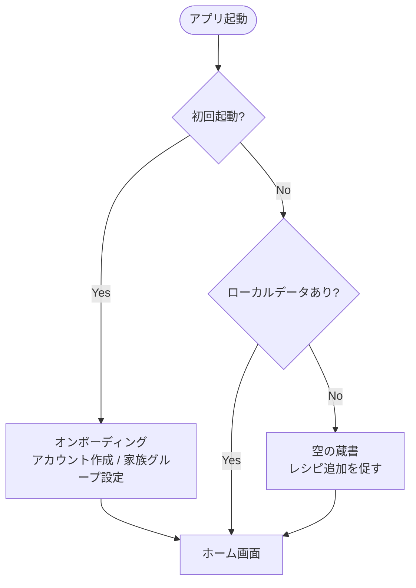
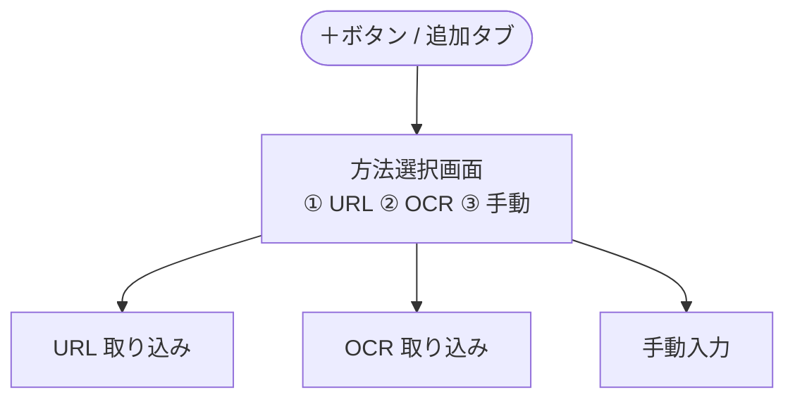
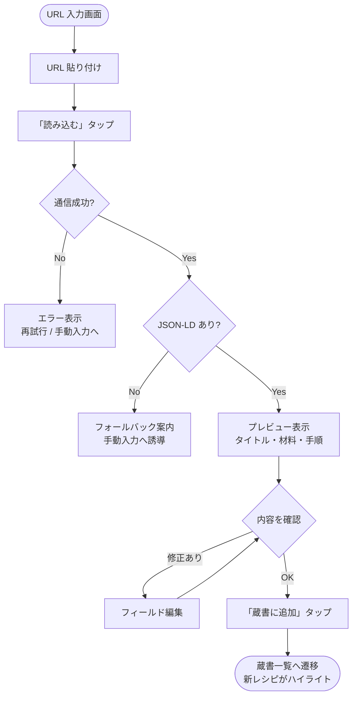
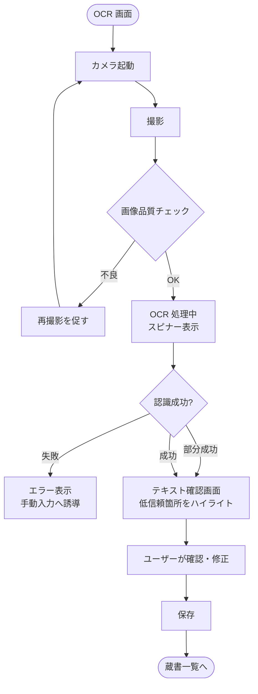
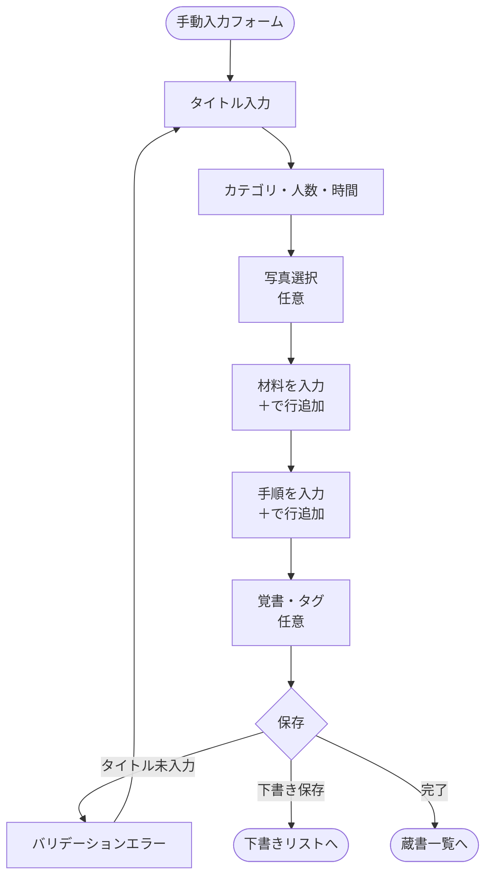
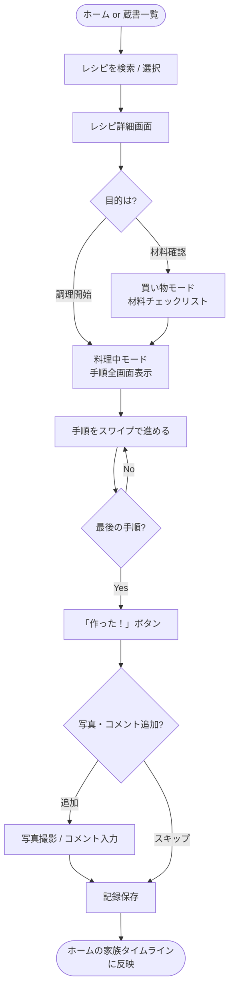
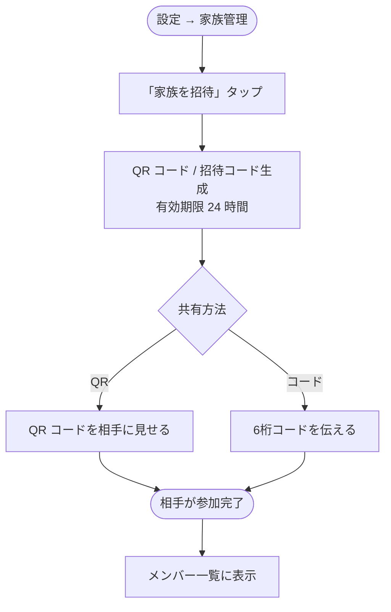
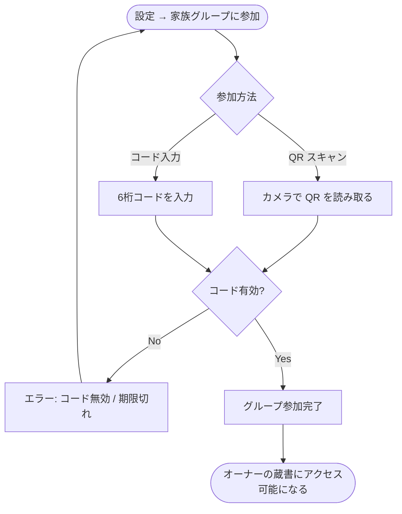
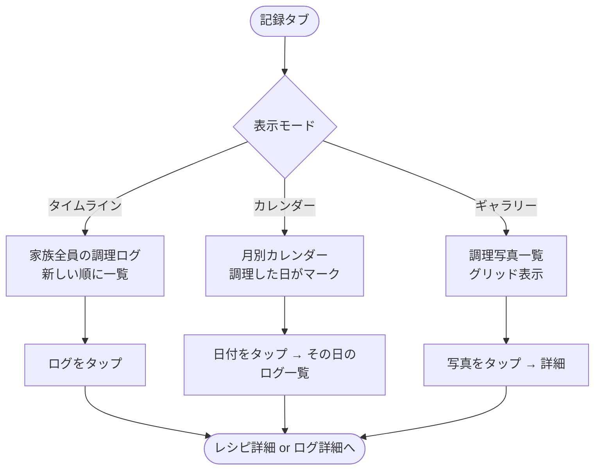
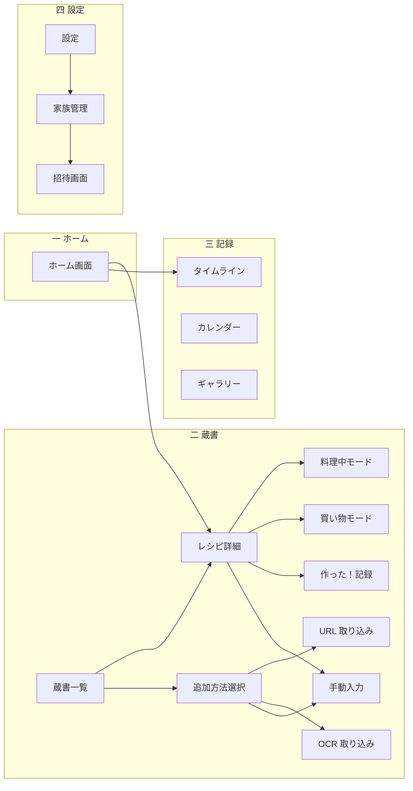

# だいどこ — 利用フロー

> 改訂: 2026-05-04  
> ステータス: Draft

---

## 1. アプリ起動フロー

---

## 2. レシピ追加フロー

### 2.1 方法選択

---

### 2.2 URL 取り込みフロー

---

### 2.3 OCR 取り込みフロー

---

### 2.4 手動入力フロー

---

## 3. 調理フロー（メインシナリオ）

---

## 4. 家族共有フロー

### 4.1 招待する側（オーナー）

---

### 4.2 参加する側（家族メンバー）

---

## 5. タイムライン・記録閲覧フロー

---

## 6. 画面遷移マップ（全体）

