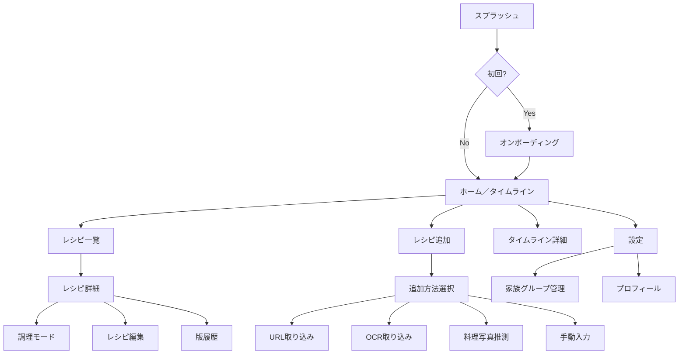

# だいどこ — 画面設計書

> 改訂: 2026-05-08 (v3 — タイポグラフィスケール追加)  
> ステータス: Draft

---

## 0. タイポグラフィシステム

実装の正規ソースは `apps/mobile/src/constants/theme.ts` の `Typography` オブジェクト。

### フォントサイズスケール

| トークン   | サイズ | 主な用途                                                   |
| ---------- | -----: | ---------------------------------------------------------- |
| `wordmark` |    9px | DAIDOKO 装飾テキスト（意図的な最小表示・審美性優先）       |
| `xxs`      |   11px | タグチップ・今後追加予定など最小補助ラベル                 |
| `xs`       |   12px | タイムスタンプ・メタ情報（調理時間・人数）・グループラベル |
| `sm`       |   13px | フォームラベル・カード副情報・補足テキスト・フィルタチップ |
| `base`     |   15px | **本文**（材料名・手順テキスト・カードタイトル・設定項目） |
| `md`       |   17px | セクションヘッダー・ボタン CTA                             |
| `lg`       |   20px | 画面タイトル・レシピ名（詳細）・料理中ステップ番号         |
| `xl`       |   24px | ヒーロー数値                                               |
| `timer`    |   36px | タイマーカウントダウン数値                                 |

### フォントウェイトスケール

| トークン   | 値  | 用途                                             |
| ---------- | --- | ------------------------------------------------ |
| `regular`  | 400 | 本文・補足説明・ナビゲーションテキスト           |
| `medium`   | 500 | カードタイトル・セクションヘッダー・画面タイトル |
| `semibold` | 600 | ボタン CTA・強調ラベル・タイマー数値             |

### 運用ルール

- `xs (12px)` 未満のフォントサイズを **本文・ラベルに使用することを禁止**する。`wordmark (9px)` は装飾専用。
- `base (15px)` 以上のテキストには `fontWeight` を必ず明示すること（未指定は `regular` と同義）。
- `Colors.muted (#5A4A34)` はコントラスト比が低いため、**本文テキストへの使用を禁止**する。プレースホルダーおよび disabled 状態に限定する。

---

## 1. 画面構成概要



---

## 2. 画面一覧

| ID   | 画面名                 | 概要                                      | 優先度 |
| ---- | ---------------------- | ----------------------------------------- | ------ |
| S01  | スプラッシュ           | 起動アニメーション・ロゴ表示              | P0     |
| S02  | オンボーディング       | 初回ユーザー向けセットアップ（3ステップ） | P0     |
| S03  | ホーム／タイムライン   | 家族の調理記録タイムライン                | P0     |
| S04  | レシピ一覧             | 全レシピのリスト・検索・フィルタ          | P0     |
| S05  | レシピ詳細             | 材料・手順・メモ・調理履歴                | P0     |
| S06  | 調理モード             | ステップバイステップ・タイマー付き        | P0     |
| S07  | 調理記録登録           | 写真・評価・メモを記録                    | P0     |
| S08  | レシピ追加（方法選択） | URL/OCR/料理写真推測/手動 の入口          | P0     |
| S09  | URL取り込み            | URLからレシピを自動抽出                   | P1     |
| S10  | OCR取り込み            | カメラ/ギャラリーから文字認識             | P1     |
| S10b | 料理写真推測           | 料理写真から確認前提の下書きを作成        | P1     |
| S11  | 手動入力               | レシピを直接入力するフォーム              | P0     |
| S12  | レシピ編集             | 既存レシピの修正（新Revision生成）        | P0     |
| S13  | 版履歴                 | RecipeRevisionの一覧・比較                | P2     |
| S14  | タグ管理               | タグの作成・編集・削除                    | P1     |
| S15  | 設定                   | アプリ設定のハブ                          | P0     |
| S16  | 家族グループ管理       | 招待・メンバー一覧                        | P1     |
| S17  | プロフィール編集       | 名前・アイコン変更                        | P1     |
| S18  | バックアップ・復元     | データエクスポート / インポート           | P2     |

---

## 3. 画面詳細

---

### S01 スプラッシュ

**目的**: アプリ起動のブランド演出・初期化処理の待機

**レイアウト**:

```
┌─────────────────────┐
│                     │
│                     │
│       [臺所]        │  ← ロゴ（縦組み or 家紋スタイル）
│                     │     中央に配置。フェードイン
│    D A I D O K O    │  ← イタリックサブテキスト
│                     │
│                     │
└─────────────────────┘
```

**画面仕様**:

- 背景色: `#0A0805`（color.bg）
- ロゴアニメーション: 0.8s フェードイン（ease-out-expo）
- 表示時間: 最低 1.2s + DB初期化完了まで待機
- 次画面: 初回 → S02、それ以外 → S03

---

### S02 オンボーディング（3ステップ）

**目的**: 初回ユーザーにコンセプトを伝え、名前と家族設定を促す

**ステップ構成**:

| Step | タイトル         | 内容                                             |
| ---- | ---------------- | ------------------------------------------------ |
| 1/3  | ようこそ、臺所へ | コンセプト説明・イラスト                         |
| 2/3  | あなたの名前は？ | displayName 入力                                 |
| 3/3  | 家族と使う？     | 新規グループ作成 / 招待コード入力 / ひとりで使う |

**画面仕様**:

- ページインジケーター（3ドット）
- 「スキップ」はStep 1のみ表示（→ひとりで使うに相当）
- Step 3 でグループ選択後に完了 → S03へ

---

### S03 ホーム／タイムライン

**目的**: 家族の最近の調理記録を時系列で確認する

**デザイン方針**: ヘッダーバーを廃止し、コンテンツ領域を最大化する。アプリ名はタブバーの右端に `DAIDOKO`（イタリック体・極小）として添える。

**レイアウト**:

```
┌─────────────────────┐
│ [今週][今月][すべて]   DAIDOKO │ ← フィルタタブ + 右端に極小ロゴ
├─────────────────────┤
│ 2026-05-04          │  ← 日付ヘッダー（sticky）
│ ┌─────────────────┐ │
│ │ [写真]  肉じゃが │ │  ← CookingLog カード
│ │ 恵 ★★★★☆    │ │
│ │ "だし多めにした" │ │
│ └─────────────────┘ │
│ 2026-05-03          │
│ ┌─────────────────┐ │
│ │ [写真]  味噌汁  │ │
│ └─────────────────┘ │
│                 [＋]│  ← FAB（右下固定）
├─────────────────────┤
│ [🏠] [📖] [＋] [⚙] │  ← タブバー
└─────────────────────┘
```

**コンポーネント・仕様**:

- `TimelineCard`: 写真サムネイル / レシピ名 / 調理者名 / 星評価 / メモプレビュー
- タップ → S05（レシピ詳細）
- 長押し → コンテキストメニュー（削除・共有）
- `DAIDOKO` 表示: フォント Cormorant Garamond italic / 9px / `#5A4A34`（muted）。ブランド存在感を損なわず画面占有ゼロ
- **FAB（Floating Action Button）**: 右下固定、金色丸ボタン（φ48px）→ S08（追加方法選択）。ドロップシャドウで浮遊感を演出
- タブバー: ホーム / レシピ一覧 / 追加 / 設定

---

### S04 レシピ一覧

**目的**: 家族のレシピを検索・閲覧する

**レイアウト**:

```
┌─────────────────────┐
│ [🔍 レシピを探す  ] │  ← 検索バー（常時表示）
├─────────────────────┤
│ [全て][肉][魚][野菜]│  ← タグフィルタ（横スクロール）
├─────────────────────┤
│ 6 件（食材名でヒットあり） │  ← 検索中のみ表示
├─────────────────────┤
│ ┌──────┐ ┌──────┐  │
│ │[写真]│ │[写真]│  │  ← グリッド2列（デフォルト）
│ │肉じゃが│ │豚汁  │  │  ← 食材ヒット時: ボーダー金色
│ │🥬 玉ねぎ│ │🥬 玉ねぎ│  │  ← ヒット食材バッジ
│ └──────┘ └──────┘  │
├─────────────────────┤
│ [🏠] [📖] [＋] [⚙] │
└─────────────────────┘
```

**検索仕様**:

| 検索対象   | 説明                                                                 |
| ---------- | -------------------------------------------------------------------- |
| レシピ名   | 前方・中間一致。FTS5 による全文検索                                  |
| よみがな   | ひらがな・カタカナ正規化後に照合                                     |
| タグ名     | タグの完全一致・前方一致                                             |
| **食材名** | **Ingredient.name の中間一致。複数食材がヒットした場合はすべて表示** |

**食材ヒット時の UI**:

- カードのボーダーを `color.goldDim`（`#A07A44`）に変化させてヒットを視覚化
- カード下部にヒット食材名を最大2件 + 超過分を「…」で表示（`🥬 玉ねぎ・にんじん …`）
- 検索バー下に「N 件（食材名でヒットあり）」のヒント行を表示

**その他機能**:

- フィルタ: タグ・調理時間・最終調理日
- ソート: 更新順 / 名前順 / よく作る順
- 表示切替: グリッド2列 ↔ リスト
- タップ → S05（レシピ詳細）

---

### S05 レシピ詳細

**目的**: レシピの材料・手順・メモを確認し、調理・編集に進む

**レイアウト**:

```
┌─────────────────────┐
│ ← [写真（全幅）]    │  ← ヒーロー画像 + 戻るボタン
│         ⋮           │  ← 右上メニュー（編集・共有・削除）
├─────────────────────┤
│ 肉じゃが            │  ← タイトル
│ 4人前  ⏱ 30分      │  ← サブ情報
│ [肉] [定番] [煮物]  │  ← タグ
├─────────────────────┤
│ ▼ 材料              │  ← セクション（折り畳み可）
│   じゃがいも  3個   │
│   玉ねぎ     1個   │
│   牛肉      200g   │
│   ...               │
├─────────────────────┤
│ ▼ 手順              │
│   1. じゃがいもは…  │
│   2. 油を熱し…      │
│   ...               │
├─────────────────────┤
│ ▼ メモ・付箋        │
│   "だしを多めに"    │  ← Memo カード
│   [＋ メモを追加]   │
├─────────────────────┤
│ ▼ 調理履歴          │
│   05/04 恵 ★★★★☆  │
│   04/20 健 ★★★☆☆  │
├─────────────────────┤
│ [      調理開始      ]│  ← 主アクションボタン（固定）
└─────────────────────┘
```

**機能**:

- 「調理開始」→ S06
- 「⋮」メニュー → 編集（S12）/ 版履歴（S13）/ 削除
- メモは isPrivate=true の場合は本人のみ表示

---

### S06 調理モード

**目的**: 手を汚しながらでも操作できるステップ表示

**レイアウト**:

```
┌─────────────────────┐
│ ✕  肉じゃが  2/7    │  ← 閉じる / タイトル / 進捗
├─────────────────────┤
│                     │
│   Step 2 / 7        │
│                     │
│   玉ねぎをくし形に  │  ← 手順テキスト（大きめフォント）
│   切る。            │
│                     │
│   [写真]            │  ← 手順写真（あれば表示）
│                     │
├─────────────────────┤
│ [  ← 前へ  ] [次へ →]│  ← ナビゲーション
└─────────────────────┘
```

**機能**:

- スワイプ or ボタンでステップ移動
- タイマー付きステップは自動でタイマー起動オファー
- 最終ステップ → 「完了！」→ S07（記録登録）へ
- 画面タップで材料パネルをオーバーレイ表示
- 画面ロック中も続きから再開できる（ステップ番号を保存）

---

### S07 調理記録登録

**目的**: 調理の記録（写真・評価・メモ）を残す

**レイアウト**:

```
┌─────────────────────┐
│ ←  調理を記録する   │
├─────────────────────┤
│ [写真を追加 ＋]     │  ← 複数枚可
│                     │
│ レシピ: 肉じゃが    │  ← 紐付きレシピ（変更可）
│                     │
│ 評価: ★★★★☆       │  ← タップで変更
│                     │
│ メモ（任意）        │
│ ┌─────────────────┐ │
│ │                 │ │
│ └─────────────────┘ │
│                     │
│ 日時: 2026-05-04    │  ← デフォルト=今 / 変更可
├─────────────────────┤
│ [       保存       ] │
└─────────────────────┘
```

**v1.0.0 実装メモ**:

- 写真追加は Android ネイティブのカメラ/ライブラリ picker から最大 6 枚まで追加できる。
- 選択した写真はアプリ document 領域へコピーしてから `cooking_photos` に保存する。一時 URI やダミーパスは保存しない。
- 評価・メモ・調理日時と写真を保存対象とする。

---

### S08 レシピ追加（方法選択）

**目的**: レシピ追加の入口。5つの方法から選ぶ

**レイアウト**:

```
┌─────────────────────┐
│ ←  レシピを追加     │
├─────────────────────┤
│                     │
│  ┌───────────────┐  │
│  │  🔗           │  │
│  │  URLから取り込む │  │  → S09
│  │  レシピサイトの │  │
│  │  URLを貼るだけ  │  │
│  └───────────────┘  │
│                     │
│  ┌───────────────┐  │
│  │  📝           │  │
│  │  テキストから作成│  │  → S10a
│  │  本文を貼り付け │  │
│  └───────────────┘  │
│                     │
│  ┌───────────────┐  │
│  │  📷           │  │
│  │  料理写真から推測│  │  → S10b
│  │  写っている料理 │  │
│  └───────────────┘  │
│                     │
│  ┌───────────────┐  │
│  │  🖼           │  │
│  │  文字入り画像から作成│  │  → S10
│  │  本・メモ・切抜き│  │
│  └───────────────┘  │
│                     │
│  ┌───────────────┐  │
│  │  ✏️           │  │
│  │  手で入力する  │  │  → S11
│  └───────────────┘  │
│                     │
└─────────────────────┘
```

---

### S10a テキストから作成

**目的**: メモ・Web 断片・家族から送られた文章などの自由文からレシピ下書きを作る

**フロー**:

1. 自由文を貼り付ける
2. 端末内のルールベース parser でタイトル・人数・時間・材料・手順に分類する
3. `RecipeForm` にプレビュー表示し、ユーザーが不足分を確認・編集する
4. 保存時は S11 と同じ `createRecipe()` を使用する

**受け入れ条件**:

- `材料` / `作り方` などの見出し付きテキストを登録できる
- 見出しがない場合でも、分量付き行を材料、番号付き行を手順として分類できる
- 分類が不完全な場合は編集フォーム上で不足項目を補える
- 生成AIに投げるための整形指示テンプレートをクリップボードにコピーできる

---

### S10b 料理写真推測

**目的**: 料理写真から、編集前提のレシピ下書きを作る

**フロー**:

1. カメラ撮影またはギャラリー選択で料理写真を入力する
2. 端末内 Image Label provider で料理・食材らしいラベルを抽出する
3. 画像内にレシピカードやメモの文字が読める場合は OCR/parser で料理名・材料・手順をフォーム初期値に反映する
4. 文字が十分に読めない場合はラベルから料理名、材料候補、汎用手順を低信頼下書きとして生成する
5. `RecipeForm` にプレビュー表示し、ユーザーが分量・手順・調味料を確認・編集する
6. 保存時は `Source(type='photo')` を作成し、`RecipeRevision.sourceId` に紐付ける

**受け入れ条件**:

- サーバー AI / サーバー画像解析に送らず、端末内 provider だけで下書きを作る
- 料理名が特定できない場合でも、保存可能な汎用下書きを表示できる
- 画像内の文字から料理名・材料・作り方が読める場合は、その内容を入力済みの `RecipeForm` として表示できる
- 画面上部に「写真だけでは分量・加熱時間・隠れた調味料を確定できない」旨の警告を表示する
- カメラ/ギャラリーの権限拒否またはキャンセル時に、手動入力へ戻れる
- E2E は同梱生成画像を使い、端末内の写真ファイルを選択しない。画像からの入力初期化は最低 100 枚の生成画像で検証する

---

### S11 手動入力

**目的**: レシピをフォームで直接入力する

**セクション構成**:

1. **基本情報**
   - タイトル（必須）
   - よみがな（任意・検索補助）
   - 人数・調理時間・下準備時間
   - タグ選択

2. **材料**
   - グループラベル追加可能
   - 行追加 / 削除 / 並び替え
   - 食材名 / 分量（自由テキスト）

3. **手順**
   - 行追加 / 削除 / 並び替え
   - テキスト + タイマー設定（任意）
   - 写真添付（任意）

4. **メモ**
   - 自由テキスト
   - 公開 / 非公開トグル

**保存**: 下書き自動保存（3秒ごとにローカルに保存）

---

### S12 レシピ編集

S11 と同レイアウト。既存の最新 Revision を初期値として表示。
「保存」押下で新 Revision を INSERT（元データは保持）。

---

### S15 設定

**目的**: アプリ設定のハブ画面

**項目一覧**:

```
┌─────────────────────┐
│ ←  設定             │
├─────────────────────┤
│ アカウント          │
│   プロフィール編集  │  → S17
│                     │
│ 家族グループ        │
│   グループ管理      │  → S16
│                     │
│ データ              │
│   バックアップ・復元│  → S18
│   ストレージ使用量  │
│                     │
│ アプリ              │
│   テーマ            │  （将来: ライトモード対応）
│   通知設定          │
│   バージョン情報    │
└─────────────────────┘
```

---

### S16 家族グループ管理

**目的**: 招待コードでメンバーを追加・管理する

**レイアウト**:

```
┌─────────────────────┐
│ ←  家族グループ     │
├─────────────────────┤
│ グループ名: 佐藤家  │
│                     │
│ 招待コード          │
│ ┌─────────────────┐ │
│ │   AB C123       │ │  ← 大きく表示・タップでコピー
│ └─────────────────┘ │
│ [コードを更新する]  │
├─────────────────────┤
│ メンバー（3人）     │
│ 👤 佐藤 恵  オーナー│
│ 👤 佐藤 健  メンバー│
│ 👤 佐藤 陽  メンバー│
└─────────────────────┘
```

---

### S18 バックアップ・復元

**目的**: 端末内データの復旧と、他端末・iOS への機種変更移行を行う。

**レイアウト**:

```
┌─────────────────────┐
│ ← バックアップ・復元 │
├─────────────────────┤
│ 最新バックアップ     │
│ 2026/05/30 10:30    │
│ [バックアップを作成] │
│ [最新バックアップから復元] │
├─────────────────────┤
│ 機種変更バックアップ │
│ 2026/05/30 10:35    │
│ [移行ファイルを作成] │
│ [最新移行ファイルを共有] │
│ [移行ファイルから復元] │
├─────────────────────┤
│ 保存済みバックアップ │
└─────────────────────┘
```

**仕様**:

- 通常バックアップ: `FileSystem.documentDirectory/backups/` に JSON として保存する。
- 移行バックアップ: `daidoko-transfer-YYYYMMDD-HHmmss.daidoko.zip` として保存する。
- ZIP 内容: `manifest.json` と `cooking-photos/` 配下の調理記録写真。
- `manifest.json` には SQLite 主要テーブルの JSON、写真 ID、ZIP 内写真パス、元端末の `local_path` を含める。
- 移行ファイル復元時は、写真を新端末の `FileSystem.documentDirectory/cooking-photos/` に書き出し、`cooking_photos.local_path` を新しい保存先へ置き換える。
- 復元前には確認ダイアログを表示し、現在の端末内データを置き換えることを明示する。

---

## 4. ナビゲーション構造

| タブ   | アイコン | 画面                         |
| ------ | -------- | ---------------------------- |
| ホーム | 🏠       | S03 タイムライン             |
| レシピ | 📖       | S04 レシピ一覧               |
| 追加   | ＋       | S08 追加方法選択（モーダル） |
| 設定   | ⚙        | S15 設定                     |

**モーダル表示**: S08（追加）はボトムシートとして表示。タブバーの「＋」を押すと下から出現。

---

## 5. コンポーネント対応表

| コンポーネント名     | 使用画面      | 説明                                                                               |
| -------------------- | ------------- | ---------------------------------------------------------------------------------- |
| `AppHeader`          | 全画面        | タイトル + 右アクションボタン                                                      |
| `TabBar`             | S03〜S15      | 4タブ固定ナビゲーション                                                            |
| `TimelineCard`       | S03           | 調理記録1件のカード                                                                |
| `RecipeCard`         | S04           | レシピ1件のカード（グリッド/リスト）。食材ヒット時はボーダー金色＋ヒットバッジ表示 |
| `IngredientRow`      | S05, S11, S12 | 材料1行                                                                            |
| `StepRow`            | S05, S11, S12 | 手順1行                                                                            |
| `MemoCard`           | S05           | メモ付箋                                                                           |
| `RatingStars`        | S07           | 1〜5星評価                                                                         |
| `TagChip`            | S04, S05, S11 | タグラベル                                                                         |
| `TimerWidget`        | S06           | カウントダウンタイマー                                                             |
| `PhotoGrid`          | S05, S07      | 写真グリッド（1〜4枚）                                                             |
| `InviteCodeCard`     | S16           | 招待コード表示                                                                     |
| `ActionButton`       | S05           | 「調理開始」などの主CTA（画面下固定）                                              |
| `FAB`                | S03           | フローティングアクションボタン。右下固定・金色φ48px → S08                          |
| `IngredientHitBadge` | S04           | 食材名ヒット時のカード内バッジ（最大2件＋超過表示）                                |

---

## 6. 状態・エラー表示方針

| 状態                | 表示方法                                 |
| ------------------- | ---------------------------------------- |
| ローディング        | スケルトンスクリーン（shimmer）          |
| 空状態（レシピ0件） | イラスト + 誘導メッセージ + 追加ボタン   |
| ネットワークエラー  | トップに非侵襲バナー（同期失敗を通知）   |
| 操作完了            | ボトムトースト（2秒で消える）            |
| 削除確認            | ボトムシートダイアログ（破壊的操作のみ） |
| 競合検出            | 全画面モーダル（どちらを使うか選択）     |
