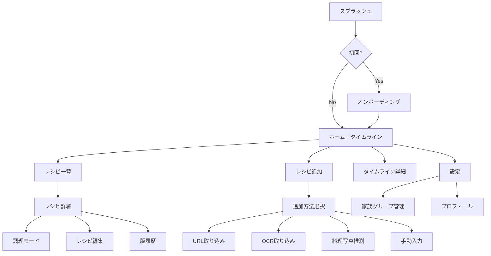

# だいどこ — 画面設計書

> 改訂: 2026-05-08 (v3 — タイポグラフィスケール追加)  
> ステータス: Draft

---

## 0. タイポグラフィシステム

実装の正規ソースは `apps/mobile/src/constants/theme.ts` の `Typography` オブジェクト。

### フォントサイズスケール

| トークン   | サイズ | 主な用途                                                   |
| ---------- | -----: | ---------------------------------------------------------- |
| `wordmark` |    9px | DAIDOKO 装飾テキスト（意図的な最小表示・審美性優先）       |
| `xxs`      |   11px | タグチップ・今後追加予定など最小補助ラベル                 |
| `xs`       |   12px | タイムスタンプ・メタ情報（調理時間・人数）・グループラベル |
| `sm`       |   13px | フォームラベル・カード副情報・補足テキスト・フィルタチップ |
| `base`     |   15px | **本文**（材料名・手順テキスト・カードタイトル・設定項目） |
| `md`       |   17px | セクションヘッダー・ボタン CTA                             |
| `lg`       |   20px | 画面タイトル・レシピ名（詳細）・料理中ステップ番号         |
| `xl`       |   24px | ヒーロー数値                                               |
| `timer`    |   36px | タイマーカウントダウン数値                                 |

### フォントウェイトスケール

| トークン   | 値  | 用途                                             |
| ---------- | --- | ------------------------------------------------ |
| `regular`  | 400 | 本文・補足説明・ナビゲーションテキスト           |
| `medium`   | 500 | カードタイトル・セクションヘッダー・画面タイトル |
| `semibold` | 600 | ボタン CTA・強調ラベル・タイマー数値             |

### 運用ルール

- `xs (12px)` 未満のフォントサイズを **本文・ラベルに使用することを禁止**する。`wordmark (9px)` は装飾専用。
- `base (15px)` 以上のテキストには `fontWeight` を必ず明示すること（未指定は `regular` と同義）。
- `Colors.muted (#5A4A34)` はコントラスト比が低いため、**本文テキストへの使用を禁止**する。プレースホルダーおよび disabled 状態に限定する。

---

## 1. 画面構成概要


```mermaid
graph TD
    A[スプラッシュ] --> B{初回?}
    B -->|Yes| C[オンボーディング]
    B -->|No| D[ホーム／タイムライン]
    C --> D

    D --> E[レシピ一覧]
    D --> F[レシピ追加]
    D --> G[タイムライン詳細]
    D --> H[設定]

    E --> I[レシピ詳細]
    I --> J[調理モード]
    I --> K[レシピ編集]
    I --> L[版履歴]

    F --> M[追加方法選択]
    M --> N[URL取り込み]
   M --> O[OCR取り込み]
   M --> P[料理写真推測]
   M --> T[手動入力]

    H --> Q[家族グループ管理]
    H --> R[プロフィール]
```

---

## 2. 画面一覧

| ID   | 画面名                 | 概要                                      | 優先度 |
| ---- | ---------------------- | ----------------------------------------- | ------ |
| S01  | スプラッシュ           | 起動アニメーション・ロゴ表示              | P0     |
| S02  | オンボーディング       | 初回ユーザー向けセットアップ（3ステップ） | P0     |
| S03  | ホーム／タイムライン   | 家族の調理記録タイムライン                | P0     |
| S04  | レシピ一覧             | 全レシピのリスト・検索・フィルタ          | P0     |
| S05  | レシピ詳細             | 材料・手順・メモ・調理履歴                | P0     |
| S06  | 調理モード             | ステップバイステップ・タイマー付き        | P0     |
| S07  | 調理記録登録           | 写真・評価・メモを記録                    | P0     |
| S08  | レシピ追加（方法選択） | URL/OCR/料理写真推測/手動 の入口          | P0     |
| S09  | URL取り込み            | URLからレシピを自動抽出                   | P1     |
| S10  | OCR取り込み            | カメラ/ギャラリーから文字認識             | P1     |
| S10b | 料理写真推測           | 料理写真から確認前提の下書きを作成        | P1     |
| S11  | 手動入力               | レシピを直接入力するフォーム              | P0     |
| S12  | レシピ編集             | 既存レシピの修正（新Revision生成）        | P0     |
| S13  | 版履歴                 | RecipeRevisionの一覧・比較                | P2     |
| S14  | タグ管理               | タグの作成・編集・削除                    | P1     |
| S15  | 設定                   | アプリ設定のハブ                          | P0     |
| S16  | 家族グループ管理       | 招待・メンバー一覧                        | P1     |
| S17  | プロフィール編集       | 名前・アイコン変更                        | P1     |
| S18  | バックアップ・復元     | データエクスポート / インポート           | P2     |
| S19  | お店の味に近づける     | 感想＋写真でレシピを AI 調整（差分確認）  | P1     |

---

## 3. 画面詳細

---

### S01 スプラッシュ

**目的**: アプリ起動のブランド演出・初期化処理の待機

**レイアウト**:

```
┌─────────────────────┐
│                     │
│                     │
│       [臺所]        │  ← ロゴ（縦組み or 家紋スタイル）
│                     │     中央に配置。フェードイン
│    D A I D O K O    │  ← イタリックサブテキスト
│                     │
│                     │
└─────────────────────┘
```

**画面仕様**:

- 背景色: `#0A0805`（color.bg）
- ロゴアニメーション: 0.8s フェードイン（ease-out-expo）
- 表示時間: 最低 1.2s + DB初期化完了まで待機
- 次画面: 初回 → S02、それ以外 → S03

---

### S02 オンボーディング（3ステップ）

**目的**: 初回ユーザーにコンセプトを伝え、名前と家族設定を促す

**ステップ構成**:

| Step | タイトル         | 内容                                             |
| ---- | ---------------- | ------------------------------------------------ |
| 1/3  | ようこそ、臺所へ | コンセプト説明・イラスト                         |
| 2/3  | あなたの名前は？ | displayName 入力                                 |
| 3/3  | 家族と使う？     | 新規グループ作成 / 招待コード入力 / ひとりで使う |

**画面仕様**:

- ページインジケーター（3ドット）
- 「スキップ」はStep 1のみ表示（→ひとりで使うに相当）
- Step 3 でグループ選択後に完了 → S03へ

---

### S03 ホーム／タイムライン

**目的**: 家族の最近の調理記録を時系列で確認する

**デザイン方針**: ヘッダーバーを廃止し、コンテンツ領域を最大化する。アプリ名はタブバーの右端に `DAIDOKO`（イタリック体・極小）として添える。

**レイアウト**:

```
┌─────────────────────┐
│ [今週][今月][すべて]   DAIDOKO │ ← フィルタタブ + 右端に極小ロゴ
├─────────────────────┤
│ 2026-05-04          │  ← 日付ヘッダー（sticky）
│ ┌─────────────────┐ │
│ │ [写真]  肉じゃが │ │  ← CookingLog カード
│ │ 恵 ★★★★☆    │ │
│ │ "だし多めにした" │ │
│ └─────────────────┘ │
│ 2026-05-03          │
│ ┌─────────────────┐ │
│ │ [写真]  味噌汁  │ │
│ └─────────────────┘ │
│                 [＋]│  ← FAB（右下固定）
├─────────────────────┤
│ [🏠] [📖] [＋] [⚙] │  ← タブバー
└─────────────────────┘
```

**コンポーネント・仕様**:

- `TimelineCard`: 写真サムネイル / レシピ名 / 調理者名 / 星評価 / メモプレビュー
- タップ → S05（レシピ詳細）
- 長押し → コンテキストメニュー（削除・共有）
- `DAIDOKO` 表示: フォント Cormorant Garamond italic / 9px / `#5A4A34`（muted）。ブランド存在感を損なわず画面占有ゼロ
- **FAB（Floating Action Button）**: 右下固定、金色丸ボタン（φ48px）→ S08（追加方法選択）。ドロップシャドウで浮遊感を演出
- タブバー: ホーム / レシピ一覧 / 追加 / 設定
- **つくりたい棚（作りたいリスト, 2026-07 実装）**: タイムライン上部（月間統計の上）に
  横スクロールのカード棚（サムネ＋タイトル）。S05 のブックマーク（`recipes.pinnedAt`）で
  追加され、新しくピンした順に表示。タップで S05 へ。ピンが 0 件なら棚ごと非表示

> **主役機能への改修（`docs/お店の味を再現設計.md` §4.3）**:
> ①最上部に「お店の料理を撮る」ボタン（1 タップで撮影へ直行。FAB は残す）
> ②「つくりたい」→「**再現したい**」に改称（データは `recipes.pinnedAt` のまま）
> ③空状態を「まだ調理記録がありません」から主役を語る文言＋撮影ボタンに置き換え
> ④タイムラインのカードは「作った」「お店で食べた」を出し分け（`cooking_logs.kind`・店名があれば表示）
> ~~⑤初回起動時のみ、記念ボーナス付与の告知を出す~~ → **2026-08-13 に撤去**（記念ボーナス自体を
> やめたため。コーチマーク 2 枚は初回から表示される — `docs/フリーミアム設計.md`）

---

### S04 レシピ一覧

**目的**: 家族のレシピを検索・閲覧する

**レイアウト**:

```
┌─────────────────────┐
│ [🔍 レシピを探す  ] │  ← 検索バー（常時表示）
├─────────────────────┤
│ [全て][肉][魚][野菜]│  ← タグフィルタ（横スクロール）
├─────────────────────┤
│ 📖 レシピ帖 [わが家の帖 5品][＋新しい帖] │  ← 帖の棚（横スクロール・検索中は隠す）
├─────────────────────┤
│ 6 件（食材名でヒットあり） │  ← 検索中のみ表示
├─────────────────────┤
│ ┌──────┐ ┌──────┐  │
│ │[写真]│ │[写真]│  │  ← グリッド2列（デフォルト）
│ │肉じゃが│ │豚汁  │  │  ← 食材ヒット時: ボーダー金色
│ │🥬 玉ねぎ│ │🥬 玉ねぎ│  │  ← ヒット食材バッジ
│ └──────┘ └──────┘  │
├─────────────────────┤
│ [🏠] [📖] [＋] [⚙] │
└─────────────────────┘
```

**検索仕様**（実装 = `utils/recipeSearch.ts` のクライアント側フィルタ。±300件想定で十分高速）:

| 検索対象   | 説明                                                                 |
| ---------- | -------------------------------------------------------------------- |
| レシピ名   | 中間一致（正規化後）                                                 |
| よみがな   | titleReading を正規化後に照合（かな入力で漢字タイトルがヒット）      |
| タグ名     | 中間一致（正規化後）                                                 |
| **食材名** | **Ingredient.name の中間一致。複数食材がヒットした場合はすべて表示** |

- 正規化は両辺に `normalizeItemName`（NFKC＋カタカナ→ひらがな＋小文字化＋空白除去）を適用
  — 「タマゴ⇄たまご」「ｂｂｑ⇄BBQ」「ﾋﾟｰﾏﾝ⇄ピーマン」を吸収（2026-07 実装）
- AI 名寄せキャッシュ（`name_aliases`）があれば「卵⇄たまご」級の漢字⇄かなもヒット
  （キャッシュ空なら正規化のみに劣化・誤爆なし）
- FTS5 テーブル（`recipe_fts`）はインデックス維持のみで検索経路には未接続（将来の大規模化に備え温存）

**食材ヒット時の UI**:

- カードのボーダーを `color.goldDim`（`#A07A44`）に変化させてヒットを視覚化
- カード下部にヒット食材名を最大2件 + 超過分を「…」で表示（`🥬 玉ねぎ・にんじん …`）
- 検索バー下に「N 件（食材名でヒットあり）」のヒント行を表示

**レシピ帖の棚**（2026-08-22 追加・S4）:

- 帖は蔵書庫の「モノ」（docs/Web共有設計.md §7）なのに、一覧からは**複数選択→「レシピ帖」**でしか
  触れず、既にある帖は設定の奥（Web 共有の管理）にしか出ていなかった。「レシピタブで帖が見えない」という
  指摘で、タグフィルタの直下に棚を置いた
- チップ = 題名・収録数・共有中なら「・共有中」。タップで帖の編集（S4: 題名・収録・公開設定）へ
- 「＋ 新しい帖」= 空の帖を作る。共有用と同じシートを **収録 0 品** で開き、共有ボタンは出さない
  （0 品は共有できない）。作ったら編集画面へ
- 検索中は隠す（検索結果の邪魔になる）。選択モードでは従来どおり「レシピ帖」アクションから作る

**その他機能**:

- フィルタ: タグ・調理時間・最終調理日
- ソート: 更新順 / 名前順 / よく作る順
- 表示切替: グリッド2列 ↔ リスト
- タップ → S05（レシピ詳細）

---

### S05 レシピ詳細

**目的**: レシピの材料・手順・メモを確認し、調理・編集に進む

**レイアウト**:

```
┌─────────────────────┐
│ ← [写真（全幅）]    │  ← ヒーロー画像 + 戻るボタン
│         ⋮           │  ← 右上メニュー（編集・共有・削除）
├─────────────────────┤
│ 肉じゃが            │  ← タイトル
│ 4人前  ⏱ 30分      │  ← サブ情報
│ [肉] [定番] [煮物]  │  ← タグ
├─────────────────────┤
│ ▼ 材料              │  ← セクション（折り畳み可）
│   じゃがいも  3個   │
│   玉ねぎ     1個   │
│   牛肉      200g   │
│   ...               │
├─────────────────────┤
│ ▼ 手順              │
│   1. じゃがいもは…  │
│   2. 油を熱し…      │
│   ...               │
├─────────────────────┤
│ ▼ メモ・付箋        │
│   "だしを多めに"    │  ← Memo カード
│   [＋ メモを追加]   │
├─────────────────────┤
│ ▼ 調理履歴          │
│   05/04 恵 ★★★★☆  │
│   04/20 健 ★★★☆☆  │
├─────────────────────┤
│ [      調理開始      ]│  ← 主アクションボタン（固定）
└─────────────────────┘
```

**機能**:

- 「調理開始」→ S06
- 「⋮」メニュー → 編集（S12）/ **共有** / 版履歴（S13）/ 削除
- メモは isPrivate=true の場合は本人のみ表示
- **ブックマーク 🔖（2026-07 実装）**: ヒーロー右上のブックマークで作りたいリストへ
  ピン留め（金色塗りつぶし=ピン済み）。S03 の「つくりたい」棚に表示される
- **人数ステッパー（2026-07 実装)**: 材料タブ先頭のステッパーで分量を自動換算
  （`scaleAmount` — 分数「1/2個」・範囲「2〜3本」・全角数字対応。servings 未登録レシピでは非表示）
- **共有（2026-07 実装）**: レシピを `formatRecipeShareText` でプレーンテキスト化して
  OS 共有シートへ。書式は「テキストから取り込み」パーサと往復可能 — 受け取った側は
  貼り付けるだけで登録できる（サーバー不要のレシピ交換）

---

### S06 調理モード

**目的**: 手を汚しながらでも操作できるステップ表示

**レイアウト**:

```
┌─────────────────────┐
│ ✕  肉じゃが  2/7    │  ← 閉じる / タイトル / 進捗
├─────────────────────┤
│                     │
│   Step 2 / 7        │
│                     │
│   玉ねぎをくし形に  │  ← 手順テキスト（大きめフォント）
│   切る。            │
│                     │
│   [写真]            │  ← 手順写真（あれば表示）
│                     │
├─────────────────────┤
│ [  ← 前へ  ] [次へ →]│  ← ナビゲーション
└─────────────────────┘
```

**機能**:

- スワイプ or ボタンでステップ移動
- タイマー付きステップは自動でタイマー起動オファー
- 最終ステップ → 「完了！」→ S07（記録登録）へ
- 画面タップで材料パネルをオーバーレイ表示
- 画面ロック中も続きから再開できる（ステップ番号を保存）

**タイマーの継続動作（2026-07 実装）**:

- カウントダウンと OS 通知のライフサイクルは `timer.store`（zustand）が所有 —
  **ステップ移動や画面離脱でタイマーは消えない**（別レシピの調理開始時のみ破棄）
- 別ステップでタイマー動作中はプログレスバー下に残り時間チップを表示。タップでそのステップへ復帰
- 動作中に別ステップでタイマーを開始しようとすると切り替え確認ダイアログ
- 「✓ 完成！記録する」でタイマー・通知とも破棄
- 残り時間は絶対終了時刻から導出（バックグラウンドで JS が止まっても復帰時に自己補正）。
  終了時刻には OS ローカル通知（アプリがバックグラウンドでも鳴る）
- 材料オーバーレイにも人数ステッパー（S05 と同じ分量換算）

**タイマーの本文自動検出（#77・2026-07 実装）**: `utils/stepTimer.ts` が手順本文の
時間表現（「10分」「約5分」「1時間半」「10〜15分」=短い方採用、「4分割」「3分の1」等は除外）を抽出する。

- 料理中モード: timerSec 未設定の手順でも検出時は「⏱ 10分 タイマーを開始（本文から検出）」を表示（DB には保存しない）
- 登録・編集フォーム: 未設定の手順に「10分を設定」チップで提案（自動では書き込まない）
- テキスト/URL/AI写真の取り込み: パース結果に自動セット（確認フォームで修正できるため）

---

### S07 調理記録登録

**目的**: 調理の記録（写真・評価・メモ）を残す

**レイアウト**:

```
┌─────────────────────┐
│ ←  調理を記録する   │
├─────────────────────┤
│ [写真を追加 ＋]     │  ← 複数枚可
│                     │
│ レシピ: 肉じゃが    │  ← 紐付きレシピ（変更可）
│                     │
│ 評価: ★★★★☆       │  ← タップで変更
│                     │
│ メモ（任意）        │
│ ┌─────────────────┐ │
│ │                 │ │
│ └─────────────────┘ │
│                     │
│ 日時: 2026-05-04    │  ← デフォルト=今 / 変更可
├─────────────────────┤
│ [       保存       ] │
└─────────────────────┘
```

**v1.0.0 実装メモ**:

- 写真追加は Android ネイティブのカメラ/ライブラリ picker から最大 6 枚まで追加できる。
- 選択した写真はアプリ document 領域へコピーしてから `cooking_photos` に保存する。一時 URI やダミーパスは保存しない。
- 評価・メモ・調理日時と写真を保存対象とする。

---

### S08 レシピ追加（方法選択）

**目的**: レシピ追加の入口。5つの方法から選ぶ

**レイアウト**:

```
┌─────────────────────┐
│ ←  レシピを追加     │
├─────────────────────┤
│                     │
│  ┌───────────────┐  │
│  │  🔗           │  │
│  │  URLから取り込む │  │  → S09
│  │  レシピサイトの │  │
│  │  URLを貼るだけ  │  │
│  └───────────────┘  │
│                     │
│  ┌───────────────┐  │
│  │  📝           │  │
│  │  テキストから作成│  │  → S10a
│  │  本文を貼り付け │  │
│  └───────────────┘  │
│                     │
│  ┌───────────────┐  │
│  │  📷           │  │
│  │  料理写真から推測│  │  → S10b
│  │  写っている料理 │  │
│  └───────────────┘  │
│                     │
│  ┌───────────────┐  │
│  │  🖼           │  │
│  │  文字入り画像から作成│  │  → S10
│  │  本・メモ・切抜き│  │
│  └───────────────┘  │
│                     │
│  ┌───────────────┐  │
│  │  ✏️           │  │
│  │  手で入力する  │  │  → S11
│  └───────────────┘  │
│                     │
└─────────────────────┘
```

> **主役機能への改修（`docs/お店の味を再現設計.md` §4.3）**:
> 並び順を「**写真からレシピ**」先頭に変更する（現行実装は 手動 → テキスト → URL → 写真 → 文字入り画像 で、
> 主役が 4 番目に埋もれている）。手動入力は最後でよい。
> なおホーム最上部の撮影ボタンから写真は直行するため、この画面は「それ以外の入口」の位置づけになる。

**入口は「手元に何があるか」で 3 グループに分ける（2026-08-23）**:

| グループ               | 入口                                            | 何を持っているか                     | AI の無料枠  |
| ---------------------- | ----------------------------------------------- | ------------------------------------ | ------------ |
| **写真から**           | 写真からレシピ / 文字入り画像から               | 料理そのもの・レシピが載っている紙面 | 使う         |
| **相談しながら決める** | AIと相談しながらつくる                          | まだ何も無い                         | 使う         |
| **文字から**           | URLから取り込み / テキストから作成 / 手動で入力 | リンク・貼り付け・自分で書く         | **使わない** |

「文字入り画像から」を**写真のグループに置く**のは、中身が端末内 OCR から AI へ変わり、
「写真を撮って AI に読ませる」点で写真からレシピと同じ性質になったため
（`docs/レシピ推論の評価設計.md` §10）。同じ理由で **Android 限定ではなくなった**。

**「無料枠を使わない」と書いてよいのは URL とテキストだけ。** 文字入り画像は AI 化で
枠を消費するようになったので、コーチマークの文言もそれに合わせてある
（移行時にここが嘘のまま残っていた）。

**コーチマーク（初回・「?」で再生）**: 写真 → AIと相談 → 手動 の 3 枚。

- **吹き出しは、ハイライトしたカードの話だけをする。** 以前の 1 枚目は「URL取り込み・文字入り画像の
  読み取りもここから」と別のカードの話を混ぜていて、しかもそのカードは吹き出しの下に隠れていた
  （Pixel 9a で確認・2026-08-23）。別の入口に触れたいなら、その入口に自分の吹き出しを持たせる
- 1 枚目の吹き出しは 2 枚目のカード（AIと相談）を丸ごと隠す。だから相談に 1 枚足した
- 無料枠は生涯 1 回＋広告（`docs/フリーミアム設計.md` §7-3）。**「1日の」「今日の」と書かない**
  （他の文言から外したとき、コーチマークだけ残っていた）
- URL・テキスト・文字入り画像は AI の枠を使わない（`ensureInferenceCredit` を通らない）ので、
  「回数制限なし」は手動の吹き出しでまとめて伝える

---

### S10a テキストから作成

**目的**: メモ・Web 断片・家族から送られた文章などの自由文からレシピ下書きを作る

**フロー**:

1. 自由文を貼り付ける
2. 端末内のルールベース parser でタイトル・人数・時間・材料・手順に分類する
3. `RecipeForm` にプレビュー表示し、ユーザーが不足分を確認・編集する
4. 保存時は S11 と同じ `createRecipe()` を使用する

**受け入れ条件**:

- `材料` / `作り方` などの見出し付きテキストを登録できる
- 見出しがない場合でも、分量付き行を材料、番号付き行を手順として分類できる
- 分類が不完全な場合は編集フォーム上で不足項目を補える
- 生成AIに投げるための整形指示テンプレートをクリップボードにコピーできる

---

### S10b 料理写真推測

**目的**: 料理写真から、編集前提のレシピ下書きを作る

**フロー**:

1. カメラ撮影またはギャラリー選択で料理写真を入力する
2. 端末内 Image Label provider で料理・食材らしいラベルを抽出する
3. 画像内にレシピカードやメモの文字が読める場合は OCR/parser で料理名・材料・手順をフォーム初期値に反映する
4. 文字が十分に読めない場合はラベルから料理名、材料候補、汎用手順を低信頼下書きとして生成する
5. `RecipeForm` にプレビュー表示し、ユーザーが分量・手順・調味料を確認・編集する
6. 保存時は `Source(type='photo')` を作成し、`RecipeRevision.sourceId` に紐付ける

**受け入れ条件**:

- サーバー AI / サーバー画像解析に送らず、端末内 provider だけで下書きを作る
- 料理名が特定できない場合でも、保存可能な汎用下書きを表示できる
- 画像内の文字から料理名・材料・作り方が読める場合は、その内容を入力済みの `RecipeForm` として表示できる
- 画面上部に「写真だけでは分量・加熱時間・隠れた調味料を確定できない」旨の警告を表示する
- カメラ/ギャラリーの権限拒否またはキャンセル時に、手動入力へ戻れる
- E2E は同梱生成画像を使い、端末内の写真ファイルを選択しない。画像からの入力初期化は最低 100 枚の生成画像で検証する

---

### S11 手動入力

**目的**: レシピをフォームで直接入力する

**セクション構成**:

1. **基本情報**
   - タイトル（必須）
   - よみがな（任意・検索補助）
   - 人数・調理時間・下準備時間
   - タグ選択

2. **材料**
   - グループラベル追加可能
   - 行追加 / 削除 / 並び替え
   - 食材名 / 分量（自由テキスト）

3. **手順**
   - 行追加 / 削除 / 並び替え
   - テキスト + タイマー設定（任意）
   - 写真添付（任意）

4. **メモ**
   - 自由テキスト
   - 公開 / 非公開トグル

**保存**: 下書き自動保存（3秒ごとにローカルに保存）

---

### S12 レシピ編集

S11 と同レイアウト。既存の最新 Revision を初期値として表示。
「保存」押下で新 Revision を INSERT（元データは保持）。

---

### S15 設定

**目的**: アプリ設定のハブ画面

**項目一覧**:

```
┌─────────────────────┐
│ ←  設定             │
├─────────────────────┤
│ アカウント          │
│   プロフィール編集  │  → S17
│                     │
│ 家族グループ        │
│   グループ管理      │  → S16
│                     │
│ データ              │
│   バックアップ・復元│  → S18
│   ストレージ使用量  │
│                     │
│ アプリ              │
│   テーマ            │  （将来: ライトモード対応）
│   通知設定          │
│   バージョン情報    │
└─────────────────────┘
```

---

### S16 家族グループ管理

**目的**: 招待コードでメンバーを追加・管理する

**レイアウト**:

```
┌─────────────────────┐
│ ←  家族グループ     │
├─────────────────────┤
│ グループ名: 佐藤家  │
│                     │
│ 招待コード          │
│ ┌─────────────────┐ │
│ │   AB C123       │ │  ← 大きく表示・タップでコピー
│ └─────────────────┘ │
│ [コードを更新する]  │
├─────────────────────┤
│ メンバー（3人）     │
│ 👤 佐藤 恵  オーナー│
│ 👤 佐藤 健  メンバー│
│ 👤 佐藤 陽  メンバー│
└─────────────────────┘
```

---

### S18 バックアップ・復元

**目的**: 端末内データの復旧と、他端末・iOS への機種変更移行を行う。

**レイアウト**:

```
┌─────────────────────┐
│ ← バックアップ・復元 │
├─────────────────────┤
│ 最新バックアップ     │
│ 2026/05/30 10:30    │
│ [バックアップを作成] │
│ [最新バックアップから復元] │
├─────────────────────┤
│ 機種変更バックアップ │
│ 2026/05/30 10:35    │
│ [移行ファイルを作成] │
│ [最新移行ファイルを共有] │
│ [移行ファイルから復元] │
├─────────────────────┤
│ 保存済みバックアップ │
└─────────────────────┘
```

**仕様**:

- 通常バックアップ: `FileSystem.documentDirectory/backups/` に JSON として保存する。
- 移行バックアップ: `daidoko-transfer-YYYYMMDD-HHmmss.daidoko.zip` として保存する。
- ZIP 内容: `manifest.json` と `cooking-photos/` 配下の調理記録写真。
- `manifest.json` には SQLite 主要テーブルの JSON、写真 ID、ZIP 内写真パス、元端末の `local_path` を含める。
- 移行ファイル復元時は、写真を新端末の `FileSystem.documentDirectory/cooking-photos/` に書き出し、`cooking_photos.local_path` を新しい保存先へ置き換える。
- 復元前には確認ダイアログを表示し、現在の端末内データを置き換えることを明示する。

### S19 お店の味に近づける

**目的**: 作ってみた感想（＋写真）で、レシピをお店の味に一歩近づける（R2 / Issue #113）。

**入口**: レシピ詳細（S05）のメニュー、および調理記録（S07）の保存直後。
S07 経由のときは、いま書いたメモが感想として入った状態で開く。

**レイアウト**:

```
┌─────────────────────┐
│ ← お店の味に近づける │
├─────────────────────┤
│ 麻婆豆腐             │
│ 作ってみてどうだった？│
│ [                  ] │
│ 味の方向を書くほど… │
├─────────────────────┤
│ 作った料理の写真(任意)│
│ [カメラ][ギャラリー] │
├─────────────────────┤
│ 🏪 お店の写真を目標に │  ← R1 の記録から自動
├─────────────────────┤
│      [AIで近づける]  │
└─────────────────────┘
        ↓ 実行後
┌─────────────────────┐
│ AI が直したところ     │
│ 甘みを抑えるため…    │
├─────────────────────┤
│ 材料                 │
│ [変更] 甜麺醤        │
│ 大さじ2 → 大さじ1    │
├─────────────────────┤
│ ここに出ていない材料… │
│ [やり直す][この内容で保存]│
└─────────────────────┘
```

**仕様**:

- **保存前に必ず差分を出す**。AI が黙って書き換えないことがこの画面の要件。
  変わった行だけを表示し、「ここに出ていない材料・手順は変わっていません」と明示する。
- 写真は任意。`cooked`（作った結果）はユーザーが撮り、`target`（店の料理）は
  R1 の「お店で食べた」記録から**自動で添える**（ユーザーには撮らせない）。
- 感想から変更点を読み取れなかったときは、再試行を促すのではなく**何を書けばよいか**を出す。
- 確定すると `updateRecipe` で新リビジョン（minor）を積み、`author_note` に感想を残す。
- 手順のタイマー・写真は引き継ぐ。ただし本文が変わった手順のタイマーは**本文から取り直す**
  （古い「5分」が残ると調理中に誤った時間を指すため）。
- 無料枠は写真レシピと同じものを消費する。

---

## 4. ナビゲーション構造

| タブ   | アイコン | 画面                         |
| ------ | -------- | ---------------------------- |
| ホーム | 🏠       | S03 タイムライン             |
| レシピ | 📖       | S04 レシピ一覧               |
| 追加   | ＋       | S08 追加方法選択（モーダル） |
| 設定   | ⚙        | S15 設定                     |

**モーダル表示**: S08（追加）はボトムシートとして表示。タブバーの「＋」を押すと下から出現。

---

## 5. コンポーネント対応表

| コンポーネント名     | 使用画面       | 説明                                                                                                                                                                                                                               |
| -------------------- | -------------- | ---------------------------------------------------------------------------------------------------------------------------------------------------------------------------------------------------------------------------------- |
| `AppHeader`          | 全画面         | タイトル + 右アクションボタン                                                                                                                                                                                                      |
| `TabBar`             | S03〜S15       | 4タブ固定ナビゲーション                                                                                                                                                                                                            |
| `TimelineCard`       | S03            | 調理記録1件のカード                                                                                                                                                                                                                |
| `RecipeCard`         | S04            | レシピ1件のカード（グリッド/リスト）。食材ヒット時はボーダー金色＋ヒットバッジ表示                                                                                                                                                 |
| `IngredientRow`      | S05, S11, S12  | 材料1行                                                                                                                                                                                                                            |
| `StepRow`            | S05, S11, S12  | 手順1行                                                                                                                                                                                                                            |
| `MemoCard`           | S05            | メモ付箋                                                                                                                                                                                                                           |
| `RatingStars`        | S07            | 1〜5星評価                                                                                                                                                                                                                         |
| `TagChip`            | S04, S05, S11  | タグラベル                                                                                                                                                                                                                         |
| `TimerWidget`        | S06            | カウントダウンタイマー                                                                                                                                                                                                             |
| `PhotoGrid`          | S05, S07       | 写真グリッド（1〜4枚）                                                                                                                                                                                                             |
| `InviteCodeCard`     | S16            | 招待コード表示                                                                                                                                                                                                                     |
| `ActionButton`       | S05            | 「調理開始」などの主CTA（画面下固定）                                                                                                                                                                                              |
| `FAB`                | S03            | フローティングアクションボタン。右下固定・金色φ48px → S08                                                                                                                                                                          |
| `IngredientHitBadge` | S04            | 食材名ヒット時のカード内バッジ（最大2件＋超過表示）                                                                                                                                                                                |
| `SourceBanner`       | S09, S10, S10a | 取り込み元の帯（読み取り精度・正規化・サイト名）。RecipeForm の上に置く。**ステータスバーの分は帯が空ける**ので、下の RecipeForm は `topInset={false}`（両方が空けると隙間、どちらも空けないと時計に被る — Pixel 9a で被っていた） |

---

## 6. 状態・エラー表示方針

| 状態                | 表示方法                                |
| ------------------- | --------------------------------------- |
| ローディング        | スケルトンスクリーン（shimmer）         |
| 空状態（レシピ0件） | イラスト + 誘導メッセージ + 追加ボタン  |
| ネットワークエラー  | トップに非侵襲バナー（同期失敗を通知）  |
| 操作完了            | ボトムトースト（2秒で消える）           |
| 削除確認            | ボトムシートダイアログ（§7 破壊的確認） |
| 競合検出            | 全画面モーダル（どちらを使うか選択）    |

---

## 7. ダイアログ規約（OS 標準ダイアログを使わない）

`Alert.alert` は Android では Material、iOS では `UIAlertController` の見た目で出る。
どちらもだいどこの世界観（暗い背景・ゴールド・細い罫線）から浮くので、**アプリ内に OS 標準の
ダイアログを出さない**。§6 の「削除確認 → ボトムシート」を、通知・確認・選択肢まで広げた規約が以下。

### 7-1. 4 種類と使い分け

| 種類           | 形               | ボタン                     | 使う場面                           | API                                     |
| -------------- | ---------------- | -------------------------- | ---------------------------------- | --------------------------------------- |
| **通知**       | 画面中央のカード | OK のみ（全幅・ゴールド）  | 失敗の報告・押す先のない情報       | `dialog.alert()`                        |
| **確認**       | ボトムシート     | キャンセル / 実行          | 実行前に一度確かめたい非破壊の操作 | `dialog.confirm()`                      |
| **破壊的確認** | ボトムシート     | キャンセル / 実行（赤）    | 消える・戻せない操作               | `dialog.confirm({ destructive: true })` |
| **選択肢**     | ボトムシート     | 選択肢を縦積み＋キャンセル | 3 つ以上から選ぶ                   | `dialog.choose()`                       |

**通知だけ中央カードにする**のは、「お知らせ（読んで閉じる）」と「操作を求める（選ぶ）」を
形で区別するため。下から出てくるものは必ず選択を伴う、と決めておくと押し間違いが減る。

**成功の通知はトーストに寄せる** — ただし条件は 2 つとも満たすときだけ:

1. 通知のあとも**その画面に留まる**（`router.back()` / `replace` が続くならトーストは見えない）
2. 利用者が**読んで判断する情報を含まない**（純粋な「できました」）

該当は 3 箇所（帖の更新・家族への参加・Web 共有の停止）。それ以外の成功通知は、
続けて画面を離れるか情報を含むので通知ダイアログのままにしてある。

### 7-2. 見た目と操作

- 背景は `rgba(10,8,5,0.85)`。シートは `#150F08`＋上辺に罫線 `#2E2418`（既存 `BottomSheet` と共通）
- **背景タップ・Android の戻るキー = キャンセル**。全種類で共通にする。
  iOS の `UIAlertController` は背景タップで閉じないが、**両 OS で挙動を揃える方を採る**。
  通知（OK のみ）は閉じる＝OK と同じで、破壊的確認は閉じる＝実行しない側に倒れるので安全
- ボタンの並び:
  - 1 つ → 全幅
  - 2 つ → 横並び。**左がキャンセル・右が実行**
  - 3 つ以上 → 縦積み。**キャンセルは最下段**
- 実行ボタンの色: 通常はゴールド `#C9A16A` に背景色の文字。破壊的は `#5C2020` の面に
  `#FF6B6B` の罫線と文字（`Colors.danger` / `Colors.dangerBg`）
- 長い本文はシート内でスクロールする（シートの高さは画面の 80% まで）

### 7-3. 命令的 API（`src/services/dialog.service.ts`）

呼び出し側は JSX を持たない場所からも呼べる必要がある
（`inference-gate.service.ts` は画面ではないのに広告視聴の確認を出す）。
また既存の 67 箇所の多くは `useCallback` の中にあり、フックにすると依存配列の書き換えが
全画面に波及する。そのため**モジュール関数**を主 API にする。

```ts
dialog.alert({ title, message?, okLabel? }): Promise<void>
dialog.confirm({ title, message?, confirmLabel?, cancelLabel?, destructive? }): Promise<boolean>
dialog.choose({ title, message?, options: [{ label, value, tone? }], cancelLabel? }): Promise<T | null>
```

構成は 4 つ:

| ファイル                         | 役割                                                      |
| -------------------------------- | --------------------------------------------------------- |
| `src/stores/dialog.store.ts`     | 表示待ちの FIFO キュー（Zustand）。ホストの有無も持つ     |
| `src/services/dialog.service.ts` | キューに積んで Promise を返す。React を読まない           |
| `src/components/DialogHost.tsx`  | キューの先頭を描く。`app/_layout.tsx` に **1 つだけ**置く |
| `src/components/AppDialog.tsx`   | 見た目だけ。状態を持たないのでそのままテストできる        |

**キューにする理由**: `Alert.alert` は OS が積んでくれるので、失敗が同時に 2 つ起きても
両方出る。自前のホストは 1 つなので、積まないと後の 1 件が黙って消える。

**ホストが無いときは却下側の値で解決する**（`confirm` → `false`、`choose` → `null`）。
Promise を宙に浮かせると呼び出し側が固まり、`true` を返すと**確認が出せないのに破壊が走る**。
`__DEV__` では警告を出して配線漏れに気づけるようにしてある。

### 7-4. 守ること

- **`react-native` の `Alert` を import しない。** lint（`no-restricted-imports`）で止めている。
  例外は無い
- **開いているシートの上にダイアログを重ねない。** RN の `<Modal>` は入れ子にすると
  iOS で表示に失敗しうる（`Attempt to present … which is already presenting`）。
  シートの中の操作が失敗したときは、**シートを閉じてから**ダイアログを出す
  （`recipes/index.tsx` の帖シートが該当した）
- ダイアログに**入力欄を置かない。** 置くならキーボードの被りを `KeyboardAvoider` で
  処理する必要がある（`Modal` の中身は画面本体と別ツリーなので、シートの中にも要る）。
  現状の 4 種類はどれも入力を取らない
- 文言は `t()` 経由。`title` は名詞句、`message` は文で書く

### 7-5. 今回の対象外

- **Expo Router の `presentation: 'modal'`**（`recipes/[id]/edit` の 1 箇所）。
  iOS でネイティブのシート遷移になるが、これは**画面遷移の演出**であって OS 標準の
  ダイアログではなく、中身は既にアプリのデザイン。触らない
- 既に自前で `<Modal>` を使っている画面（`recipes/import-photo` のコメント入力・
  `recipes/[id]/cook` の材料オーバーレイ・`CoachMarkOverlay`・`GroupPicker`）。
  いずれも既にアプリのデザインで、OS 標準の見た目は出ていない
